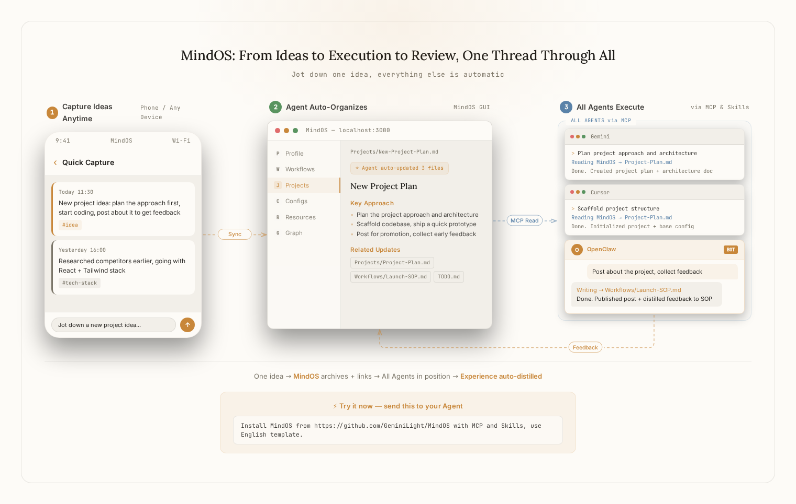
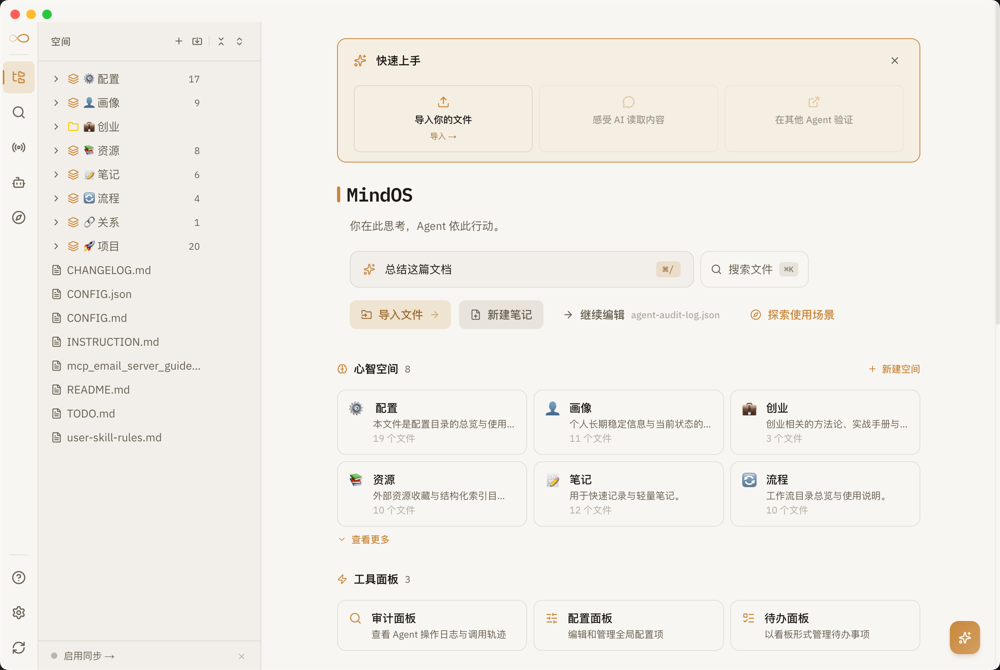
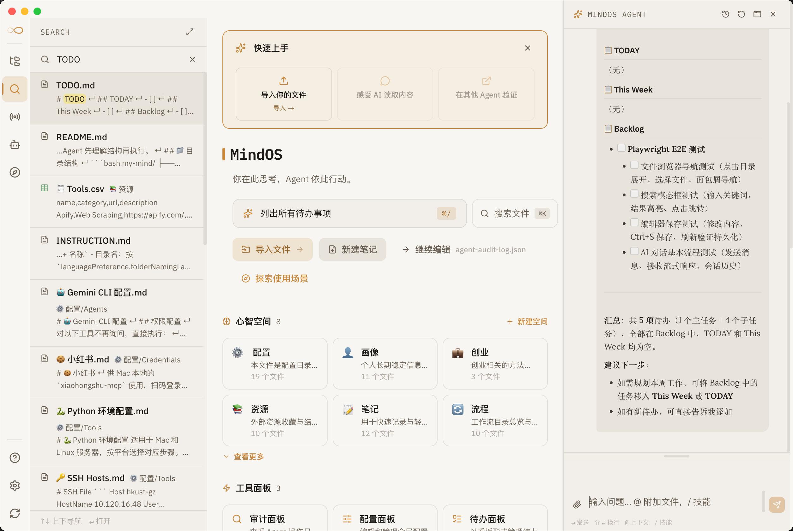
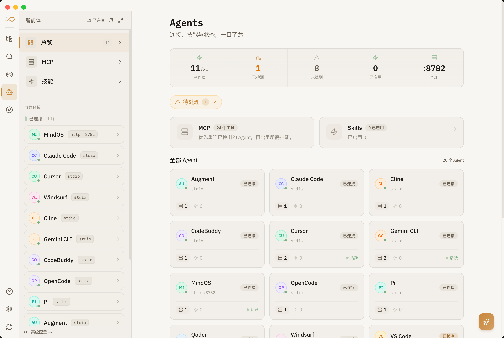
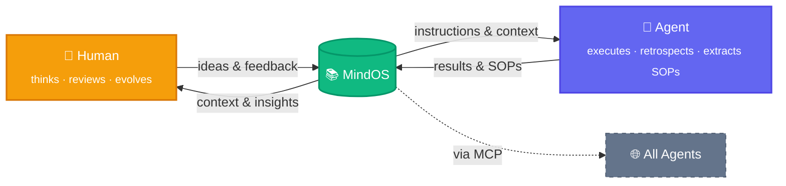

<p align="center">
  
</p>

<h1 align="center">MindOS</h1>

<p align="center">
  <strong>Human Thinks Here, Agents Act There.</strong>
</p>

<p align="center">
  <a href="README.md">English</a> | <a href="README_zh.md">中文</a>
</p>

<p align="center">
  <a href="https://tianfuwang.tech/MindOS"></a>
  <a href="https://github.com/GeminiLight/MindOS/releases/latest"></a>
  <a href="https://www.npmjs.com/package/@geminilight/mindos"></a>
  <a href="#wechat"></a>
  <a href="LICENSE"></a>
</p>

MindOS is where you think, and where your AI agents act — a local-first knowledge base shared between you and every AI you use. **Share your brain with every AI — every thought grows.**

---

<p align="center">
  <picture>
    <source media="(prefers-color-scheme: dark)" srcset="assets/images/demo-flow-dark.webp" type="image/webp" />
    <source media="(prefers-color-scheme: dark)" srcset="assets/images/demo-flow-dark.png" />
    <source media="(prefers-color-scheme: light)" srcset="assets/images/demo-flow-light.webp" type="image/webp" />
    <source media="(prefers-color-scheme: light)" srcset="assets/images/demo-flow-light.png" />
    
  </picture>
</p>

<table>
  <tr>
    <td width="50%">
      <picture>
        <source srcset="assets/images/mindos-home.webp" type="image/webp" />
        
      </picture>
    </td>
    <td width="50%">
      <picture>
        <source srcset="assets/images/mindos-chat.webp" type="image/webp" />
        
      </picture>
    </td>
  </tr>
  <tr>
    <td align="center"><em>Home — Knowledge base overview</em></td>
    <td align="center"><em>AI Chat — Converse with your knowledge in context</em></td>
  </tr>
  <tr>
    <td width="50%">
      <picture>
        <source srcset="assets/images/mindos-dashboard.webp" type="image/webp" />
        
      </picture>
    </td>
    <td width="50%">
      <picture>
        <source srcset="assets/images/mindos-echo.webp" type="image/webp" />
        
      </picture>
    </td>
  </tr>
  <tr>
    <td align="center"><em>Agents — Manage all connected AI agents</em></td>
    <td align="center"><em>Echo — Reflect and distill cognitive growth</em></td>
  </tr>
</table>

> [!IMPORTANT]
> **⭐ One-click install:** Send this to your Agent (Claude Code, Cursor, etc.) to set up everything automatically:
> ```
> Help me install MindOS from https://github.com/GeminiLight/MindOS with MCP and Skills. Use English template.
> ```
>
> **✨ Try it now:** After installation, give these a try:
> ```
> Here's my resume, read it and organize my info into MindOS.
> ```
> ```
> Help me distill the experience from this conversation into MindOS as a reusable SOP.
> ```
> ```
> Help me execute the XXX SOP from MindOS.
> ```

## 🧠 Human-AI Shared Mind

> You shape AI through thinking, AI empowers you through execution. Human and AI, growing together in one shared brain.

**1. Global Sync — Breaking Memory Silos**

Switch tools or start a new chat and you're re-transporting context, scattering knowledge. **With a built-in MCP server, MindOS connects all Agents to your core knowledge base with zero config. Record profile and project memory once to empower all AI tools.**

**2. Transparent & Controllable — No Black Boxes**

Agent memory locked in black boxes makes reasoning unauditable, erasing trust as hallucinations compound. **MindOS saves every retrieval, reflection & action as local plain text. You hold absolute mind-correction rights with a full GUI to recalibrate Agents anytime.**

**3. Symbiotic Evolution — Experience Flows Back As Instructions**

You express preferences but the next chat starts from zero, leaving your thinking useless for AI. **MindOS auto-distills every thought into your knowledge base. Clarify your standards through interaction and sharpen your cognition with each iteration—AI will never repeat the same mistake.**

> **Foundation:** Local-first by default — all data stays in local plain text for privacy, ownership, and speed.

---

## 🚀 Getting Started

> [!IMPORTANT]
> **Quick Start with Agent:** Paste this prompt into any MCP-capable Agent (Claude Code, Cursor, etc.) to install automatically, then skip to [Step 3](#3-inject-your-personal-mind-with-mindos-agent):
> ```
> Help me install MindOS from https://github.com/GeminiLight/MindOS with MCP and Skills. Use English template.
> ```

> Already have a knowledge base? Skip to [Step 4](#4-make-any-agent-ready-mcp--skills) to configure MCP + Skills.

### 1. Install

**Option A: Desktop App (macOS / Windows / Linux)**

Download from the [official website](https://tianfuwang.tech/MindOS/#quickstart) or [GitHub Releases](https://github.com/GeminiLight/MindOS/releases/latest) — double-click to install, no terminal needed.

**Option B: npm**

```bash
npm install -g @geminilight/mindos@latest
```

**Option C: Clone from source**

```bash
git clone https://github.com/GeminiLight/MindOS
cd MindOS
npm install
npm link   # registers the `mindos` command globally
```

### 2. Interactive Setup

```bash
mindos onboard
```

The setup wizard guides you through knowledge base path, template, ports, auth, AI provider, and start mode — all with sensible defaults. Config is saved to `~/.mindos/config.json`. See **[docs/en/configuration.md](docs/en/configuration.md)** for all fields.

> [!TIP]
> Choose "Background service" during onboard for auto-start on boot. Run `mindos update` anytime to upgrade.

Open the Web UI in your browser:

```bash
mindos open
```

### 3. Inject Your Personal Mind with MindOS Agent

1. Open the built-in MindOS Agent chat panel in the GUI.
2. Upload your resume or any personal/project material.
3. Send this prompt: `Help me sync this information into my MindOS knowledge base.`


### 4. Make Any Agent Ready (MCP + Skills)

**MCP** (connection) — one command to auto-install:

```bash
mindos mcp install        # interactive
mindos mcp install -g -y  # one-shot, global scope
```

**Skills** (workflow) — install one based on your language:

```bash
npx skills add https://github.com/GeminiLight/MindOS --skill mindos -g -y      # English
npx skills add https://github.com/GeminiLight/MindOS --skill mindos-zh -g -y   # Chinese
```

> For remote access, manual JSON config, and common pitfalls, see **[docs/en/supported-agents.md](docs/en/supported-agents.md)**.

## ✨ Features

**For Humans**

- **GUI Workbench**: browse, edit, search notes with unified search + AI entry (`⌘K` / `⌘/`), designed for human-AI co-creation.
- **Built-in Agent Assistant**: converse with the knowledge base in context; edits seamlessly capture human-curated knowledge.
- **One-Click Import**: drag-and-drop files with Inline AI Organize — auto-analyzes, categorizes, and writes into the knowledge base with progress tracking and undo support.
- **Guided Onboarding**: step-by-step first-run experience that helps new users set up their knowledge base and connect their first Agent.
- **Plugin Extensions**: multiple built-in renderer plugins — TODO Board, CSV Views, Wiki Graph, Timeline, Workflow Editor, Agent Inspector, and more.

**For Agents**

- **MCP Server + Skills**: stdio + HTTP dual transport, full-lineup Agent compatible (Claude Code, Cursor, Gemini CLI, etc.). Zero-config access.
- **ACP / A2A Protocols**: Agent Communication Protocol for inter-agent discovery, delegation, and orchestration. Phase 1 live with Agent Card discovery + JSON-RPC messaging.
- **Workflow Orchestration**: YAML-based workflow editor with step execution engine — define, edit, and run multi-step agent workflows visually.
- **Structured Templates**: pre-set directory structures for Profiles, Workflows, Configurations, etc., to jumpstart personal context.
- **Agent-Ready Docs**: everyday notes naturally double as high-quality executable Agent commands — no format conversion needed, write and dispatch.

**Infrastructure**

- **Security**: Bearer Token auth, path sandboxing, INSTRUCTION.md write-protection, atomic writes.
- **Knowledge Graph**: dynamically parses and visualizes inter-file references and dependencies.
- **Backlinks View**: displays all files that reference the current file, helping you understand how a note fits into the knowledge network.
- **Agent Inspector**: renders Agent operation logs as a filterable timeline to audit every tool call in detail.
- **Git Time Machine**: Git auto-sync (commit/push/pull), records every edit by both humans and Agents. One-click rollback, cross-device sync.
- **Desktop App**: native macOS/Windows/Linux app with system tray, auto-start, and local process management.

<details>
<summary><strong>Coming Soon</strong></summary>

- [ ] Deep RAG integration: retrieval-augmented generation grounded in your knowledge base for more accurate, context-aware AI responses
- [ ] ACP / A2A Phase 2: deep multi-agent collaboration with task delegation, shared context, and workflow chaining
- [ ] Experience Compiler: auto-extract corrections and preferences from agent interactions into reusable Skills/SOPs
- [ ] Knowledge Health Dashboard: visualize cognitive compound metrics — rules accumulated, agent reuse count, knowledge freshness

</details>

## ⚙️ How It Works



> **Both sides evolve.** Humans gain new insights from accumulated knowledge; Agents extract SOPs and get smarter. MindOS sits at the center — the shared second brain that grows with every interaction.

---

## 🤝 Supported Agents

> Full list with MCP config paths and manual setup: **[docs/en/supported-agents.md](docs/en/supported-agents.md)**

| Agent | MCP | Skills |
|:------|:---:|:------:|
| OpenClaw | ✅ | ✅ |
| Claude Code | ✅ | ✅ |
| Cursor | ✅ | ✅ |
| Codex | ✅ | ✅ |
| Gemini CLI | ✅ | ✅ |
| GitHub Copilot | ✅ | ✅ |
| Trae | ✅ | ✅ |
| CodeBuddy | ✅ | ✅ |
| Qoder | ✅ | ✅ |
| Cline | ✅ | ✅ |
| Windsurf | ✅ | ✅ |

---

## 📁 Project Structure

```bash
MindOS/
├── app/              # Next.js 16 Frontend — Browse, edit, and interact with AI
├── mcp/              # MCP Server — HTTP adapter that maps tools to App API
├── skills/           # MindOS Skills (`mindos`, `mindos-zh`) — Workflow guides for Agents
├── templates/        # Preset templates (`en/`, `zh/`, `empty/`) — copied to knowledge base on onboard
├── bin/              # CLI (`mindos start`, `mindos file`, `mindos ask`, `mindos agent`, etc.)
├── scripts/          # Setup wizard and helper scripts
└── README.md

~/.mindos/            # User data directory (outside project, never committed)
├── config.json       # All configuration (AI keys, port, auth token, sync settings)
├── sync-state.json   # Sync state (last sync time, conflicts)
└── mind/             # Your private knowledge base (default: ~/MindOS/mind, customizable on onboard)
```

## ⌨️ CLI Commands

> Full command reference: **[docs/en/cli-commands.md](docs/en/cli-commands.md)**

| Command | Description |
| :--- | :--- |
| **Core** | |
| `mindos onboard` | Interactive setup (config, template, start mode) |
| `mindos start` | Start app + MCP server (foreground) |
| `mindos start --daemon` | Start as background OS service |
| `mindos stop` / `restart` | Stop or restart running processes |
| `mindos dev` | Start in dev mode |
| `mindos build` | Build for production |
| `mindos status` | Show service status overview |
| `mindos open` | Open Web UI in browser |
| **Knowledge** | |
| `mindos file <sub>` | File operations (list, read, create, delete, search) |
| `mindos space <sub>` | Space management (list, create, info) |
| `mindos search "<query>"` | Search knowledge base |
| `mindos ask "<question>"` | Ask AI using your knowledge base |
| `mindos agent <sub>` | AI Agent management (list, info) |
| `mindos api <METHOD> <path>` | Raw API passthrough for developers/agents |
| **MCP & Config** | |
| `mindos mcp install` | Auto-install MCP config into your Agent |
| `mindos token` | Show auth token and MCP config |
| `mindos config <sub>` | View/update config (show, set, validate) |
| `mindos sync` | Show sync status (init, now, conflicts, on/off) |
| `mindos gateway <sub>` | Manage background service (install, start, stop) |
| `mindos doctor` | Health check |
| `mindos update` | Update to latest version |

**Main keyboard shortcuts:** `⌘K` Search · `⌘/` AI Assistant · `E` Edit · `⌘S` Save · `Esc` Close — see **[docs/en/cli-commands.md](docs/en/cli-commands.md)** for full list.

---

## 💬 Community <a name="wechat"></a>

Join our WeChat group for early access, feedback, and AI workflow discussions:

<p align="center">
  
</p>

> Scan the QR code or add WeChat **wtfly2018** to be invited.

---

## 👥 Contributors

<a href="https://github.com/GeminiLight"></a>
<a href="https://github.com/yeahjack"></a>
<a href="https://github.com/USTChandsomeboy"></a>
<a href="https://github.com/ppsmk388"></a>
<a href="https://github.com/U-rara"></a>
<a href="https://github.com/one2piece2hello"></a>
<a href="https://github.com/zz-haooo"></a>

### 🙏 Acknowledgements

This project has been published on the [LINUX DO community](https://linux.do), and we deeply appreciate the community's support and feedback.

---

## 📄 License

MIT © GeminiLight
