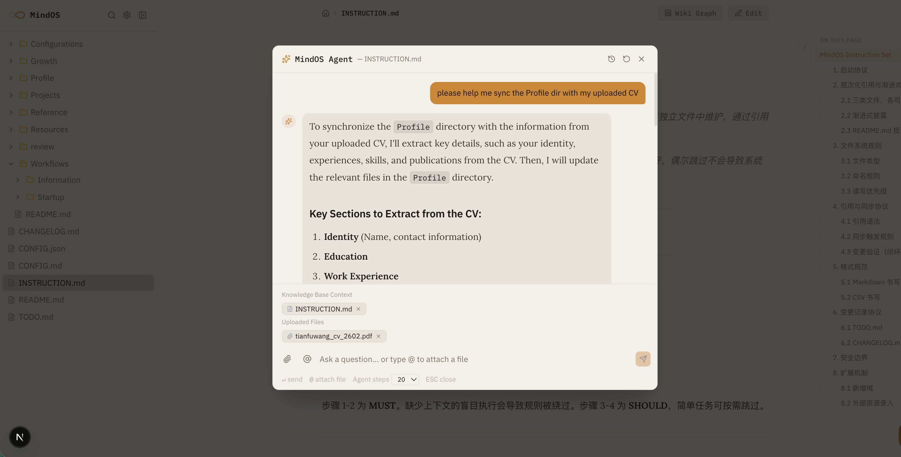
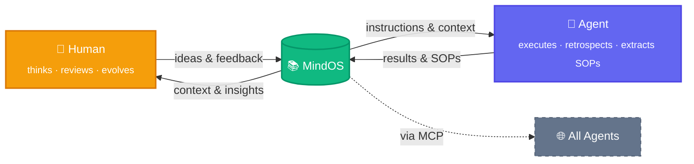

<p align="center">
  
</p>

<h1 align="center">MindOS</h1>

<p align="center">
  <strong>Human Thinks Here, Agent Acts There.</strong>
</p>

<p align="center">
  <a href="README.md">English</a> | <a href="README_zh.md">中文</a>
</p>

<p align="center">
  <a href="https://tianfuwang.tech/MindOS"></a>
  <a href="https://deepwiki.com/GeminiLight/MindOS"></a>
  <a href="LICENSE"></a>
</p>

MindOS is a **Human-AI Collaborative Mind System**—a local-first knowledge base that ensures your notes, workflows, and personal context are both human-readable and directly executable by AI Agents. **Globally sync your mind for all agents: transparent, controllable, and evolving symbiotically.**

---

## 🧠 Core Value: Human-AI Shared Mind

**1. Global Sync — Break Mind Silos**

Traditional notes are scattered across tools and APIs, so agents miss your real context when it matters. MindOS turns your local knowledge into one MCP-ready source, so every agent can sync your Profile, SOPs, and live working memory.

**2. Transparent and Controllable — Eliminate Memory Black Boxes**

Most assistant memory lives in black boxes, leaving humans unable to inspect or correct how decisions are made. MindOS writes retrieval and execution traces into local plain text, so you can audit, intervene, and improve continuously.

**3. Symbiotic Evolution — Dynamic Instruction Flow**

Static documents are hard to synchronize and weak as execution systems in real human-agent collaboration. MindOS makes notes prompt-native and reference-linked, so daily writing naturally becomes executable workflows that evolve with you.

> **Foundation:** Local-first by default - all data stays in local plain text for privacy, ownership, and speed.

## ✨ Features

### For Humans

- **GUI Collaboration Workbench**: use one command entry to browse, edit, and search efficiently (`⌘K` / `⌘/`).
- **Built-in Agent Assistant**: converse in context while edits are captured into managed knowledge.
- **Plugin Views**: use scenario-focused views like TODO, Kanban, and Timeline.

### For Agents

- **MCP Server + Skills**: connect any compatible agent to read, write, search, and run workflows.
- **Structured Templates**: start quickly with Profile, Workflows, and Configurations scaffolds.
- **Experience Auto-Distillation**: automatically distill daily work into reusable, executable SOP experience.

### Infrastructure

- **Reference Sync**: keep cross-file status and context aligned via links/backlinks.
- **Knowledge Graph**: visualize relationships and dependencies across notes.
- **Git Time Machine**: track every edit, audit history, and roll back safely.

**Coming Soon:**

- [ ] ACP (Agent Communication Protocol): connect external Agents (e.g., Claude Code, Cursor) and turn the knowledge base into a multi-Agent collaboration hub
- [ ] Deep RAG integration: retrieval-augmented generation grounded in your knowledge base for more accurate, context-aware AI responses
- [ ] Backlinks View: display all files that reference the current file, helping you understand how a note fits into the knowledge network
- [ ] Agent Inspector: render Agent operation logs as a filterable timeline to audit every tool call in detail

---

## 🚀 Getting Started

> [!IMPORTANT]
> If you have already set up your local knowledge base, skip installation and environment variable setup.
> In each Agent client (OpenClaw/Claude Code/Cursor, etc.), you only need one step:
> Configure MindOS MCP + Skills (see Section 4).
> After setup, your Agent can sync your mind, manage your knowledge base, and execute SOPs.

### 1. Install & Run

```bash
# Clone the repository
git clone https://github.com/GeminiLight/MindOS
cd MindOS

# Initialize your knowledge base from a preset template
cp -r templates/en my-mind/
# Or use the Chinese preset:
# cp -r templates/zh my-mind/

# Configure environment variables
cp app/.env.example app/.env.local
# Edit MIND_ROOT to point to the absolute path of your my-mind/ directory

# Start the application
cd app && npm install && npm run dev
```

Open [http://localhost:3000](http://localhost:3000) to get started.

### 2. Environment Variables

Configure in `app/.env.local`:

```env
MIND_ROOT=/path/to/MindOS/my-mind
MINDOS_WEB_PORT=3000
AI_PROVIDER=anthropic
ANTHROPIC_API_KEY=sk-ant-...
# OPENAI_API_KEY=sk-proj-...
# OPENAI_BASE_URL=https://api.openai.com/v1
ANTHROPIC_MODEL=claude-opus-4-6
```

| Variable | Default | Description |
| :--- | :--- | :--- |
| `MIND_ROOT` | — | **Required**. Absolute path to the knowledge base root. |
| `MINDOS_WEB_PORT` | `3000` | Optional. Web app port for MindOS frontend. |
| `AI_PROVIDER` | `anthropic` | Options: `anthropic` or `openai`. |
| `ANTHROPIC_API_KEY` | — | Required when Provider is `anthropic`. |
| `OPENAI_API_KEY` | — | Required when Provider is `openai`. |
| `OPENAI_BASE_URL` | — | Optional. Custom endpoint for proxy or OpenAI-compatible APIs. |
| `ANTHROPIC_MODEL` | `claude-opus-4-6` | Optional. Anthropic model ID for the built-in Agent. |

> [!NOTE]
> If you want the MindOS GUI to be reachable from other devices, make sure `MINDOS_WEB_PORT` is open in firewall/security-group settings and bound to an accessible host/network interface.

### 3. Inject Your Personal Mind with MindOS Agent

1. Open the built-in MindOS Agent chat panel in the GUI.
2. Upload your resume or any personal/project material.
3. Send this prompt: `Help me sync this information into my MindOS knowledge base.`

<p align="center">
  
</p>

### 4. Make Any Agent Ready (MCP + Skills)

#### 4.1 Configure MindOS MCP

Register the MindOS MCP Server in your Agent client:

MindOS now supports two transports:

- `stdio` (default): for local agents that spawn the MCP process directly.
- `Streamable HTTP`: for remote agents/devices calling over a URL.

**Option A: Local stdio (default)**

```json
{
  "mcpServers": {
    "mindos": {
      "type": "stdio",
      "command": "node",
      "args": ["/path/to/MindOS/mcp/dist/index.js"],
      "env": {
        "MIND_ROOT": "/path/to/MindOS/my-mind"
      }
    }
  }
}
```

**Option B: Remote URL (Streamable HTTP)**

> [!NOTE]
> Ensure the server port is open in firewall/security-group settings and reachable from the public network (or target client network), otherwise remote MCP access will fail.

Start MCP in HTTP mode on the host machine:

> For long-running use, run MCP in background with `nohup`, `tmux`, `screen`, or a process manager like `systemd`/`pm2`, so it remains available after terminal disconnect.

```bash
cd mcp && npm install && npm run build
MIND_ROOT=/path/to/MindOS/my-mind \
MCP_TRANSPORT=http \
MCP_HOST=0.0.0.0 \
MCP_PORT=8787 \
MCP_ENDPOINT=/mcp \
MCP_API_KEY=your-strong-token \
npm start
```

Then configure URL access on another device's Agent client (field names vary by client):

```json
{
  "mcpServers": {
    "mindos-remote": {
      "url": "http://<server-ip>:8787/mcp",
      "headers": {
        "Authorization": "Bearer your-strong-token"
      }
    }
  }
}
```

#### 4.2 Install MindOS Skills

| Skill | Description |
|-------|-------------|
| `mindos` | Knowledge base operation guide (English) — read/write notes, search, manage SOPs, maintain Profiles |
| `mindos-zh` | Knowledge base operation guide (Chinese) — same capabilities, Chinese interface |

Install one skill only (choose based on your preferred language):

```bash
# English
npx skills add https://github.com/GeminiLight/MindOS --skill mindos

# Chinese (optional)
npx skills add https://github.com/GeminiLight/MindOS --skill mindos-zh
```

MCP = connection capability, Skills = workflow capability. Enabling both gives the complete MindOS agent experience.

#### 4.3 Common Pitfalls

- Only MCP, no Skills: tools are callable, but best-practice workflows are missing.
- Only Skills, no MCP: workflow guidance exists, but the Agent cannot operate your local knowledge base.
- `MIND_ROOT` is not an absolute path: MCP tool calls will fail.
- No `MCP_API_KEY` in HTTP mode: your server is exposed on the network and unsafe.
- `MCP_HOST=127.0.0.1`: only localhost can access it; other devices cannot connect via URL.

#### 4.4 Collaboration Loop (Human + Multi-Agent)

1. Human reviews and updates notes/SOPs in the MindOS GUI (single source of truth).
2. Other Agent clients (OpenClaw, Claude Code, Cursor, etc.) connect through MCP and read the same memory/context.
3. With Skills enabled, those Agents execute workflows and SOP tasks in a guided way.
4. Execution results are written back to MindOS so humans can audit and refine continuously.


## ⚙️ How It Works

A fleeting idea becomes shared intelligence through three interlocking loops:



> **Both sides evolve.** Humans gain new insights from accumulated knowledge; Agents extract SOPs and get smarter. MindOS sits at the center — the shared second brain that grows with every interaction.

**Who is this for?**

- **AI Independent Developer** — Store personal SOPs, tech stack preferences, and project context in MindOS. Any Agent instantly inherits your work habits.
- **Knowledge Worker** — Manage research materials with bi-directional links. Your AI assistant answers questions grounded in your full context, not generic knowledge.
- **Team Collaboration** — Share a MindOS knowledge base across team members as a single source of truth. Humans and Agents read from the same playbook, keeping everyone aligned.
- **Automated Agent Operations** — Write standard workflows as Prompt-Driven documents. Agents execute directly, humans audit the results.

---

## 🤝 Supported Agents

| Agent | MCP | Skills |
|:------|:---:|:------:|
| MindOS Agent | ✅ | ✅ |
| OpenClaw | ✅ | ✅ |
| Claude Desktop | ✅ | ✅ |
| Claude Code | ✅ | ✅ |
| CodeBuddy | ✅ | ✅ |
| Cursor | ✅ | ✅ |
| Windsurf | ✅ | ✅ |
| Cline | ✅ | ✅ |
| Trae | ✅ | ✅ |
| Gemini CLI | ✅ | ✅ |
| GitHub Copilot | ✅ | ✅ |

---

## 📁 Project Structure

```bash
MindOS/
├── app/              # Next.js 15 Frontend — Browse, edit, and interact with AI
├── mcp/              # MCP Server Core — Standardized toolset for Agents
├── templates/         # Preset templates (`en/`, `zh/`) — copy one to my-mind/
├── my-mind/          # Your private shared memory (Git-ignored for privacy)
├── SERVICES.md       # Technical and Service Architecture Overview
└── README.md
```

---

## ⌨️ Keyboard Shortcuts

| Shortcut | Function |
| :--- | :--- |
| `⌘ + K` | Global Search |
| `⌘ + /` | Call AI Assistant / Sidebar |
| `E` | Press `E` in View mode to quickly enter Edit mode |
| `⌘ + S` | Save current edit |
| `Esc` | Cancel edit / Close dialog |

---

## 📄 License

MIT © GeminiLight
