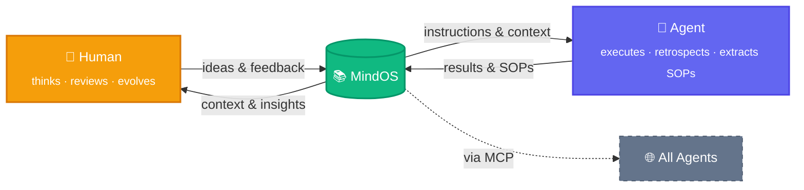

<p align="center">
  
  <br />
  <strong style="font-size: 2em;">MindOS</strong>
</p>

<p align="center">
  <strong>Human Thinks Here, Agent Acts There.</strong>
</p>

<p align="center">
  <a href="README.md">English</a> | <a href="README_zh.md">中文</a>
</p>

<p align="center">
  <a href="https://deepwiki.com/GeminiLight/MindOS"></a>
  <a href="LICENSE"></a>
</p>

MindOS is a **Human-AI Collaborative Mind System**—a local-first knowledge base that ensures your notes, workflows, and personal context are both human-readable and directly executable by AI Agents. **Globally sync your mind for all agents: transparent, controllable, and evolving symbiotically.**

---

## 🧠 Core Value: Human-AI Shared Mind

MindOS refactors the human-AI collaboration paradigm through three core pillars, enabling humans and AI to co-evolve within a single Shared Mind.

### 1. Global Mind Sync — Breaking Mind Silos
*   **Pain Point:** Traditional cloud notes are cumbersome to manage, hindered by API barriers, and have high capture friction, making it hard for Agents to access deep human context and real-time epiphanies.
*   **Shift:** Record once, empower everywhere. MindOS provides an ultra-lightweight web capture entry and a built-in standard MCP Server. Any compatible Agent can seamlessly sync your Profile, SOPs, and experiences, enabling "plug-and-play" personal context and real-time mind alignment.

### 2. Transparent & Controllable — Eliminating Agent Black Boxes
*   **Pain Point:** Current AI assistant memories are locked in system black boxes. Humans cannot intuitively inspect or correct the Agent's intermediate reasoning, leading to uncontrolled hallucinations.
*   **Shift:** Let Agents think in the light. Every Agent retrieval, reflection, and action is distilled directly into local plain text (Markdown/CSV) via MCP. Humans hold absolute audit, intervention, and mind-correction rights in the intuitive GUI workbench.

### 3. Symbiotic Evolution — Dynamic Instruction Flow
*   **Pain Point:** Traditional document management is deeply nested and hard to sync, failing to serve as an "execution engine" in complex human-AI collaborative tasks.
*   **Shift:** Knowledge as Code. Through the Prompt-Native recording paradigm and reference-driven auto-sync, your daily notes naturally become high-quality Agent execution instructions. Humans and AI inspire each other and grow together in a single Shared Mind.

> **Foundational Pillar:** MindOS adheres to the **Local-first** principle. All data is stored locally as plain text, eliminating privacy concerns and ensuring absolute data sovereignty with ultimate read/write performance.

---

## ✨ Features

### For Humans

*   **GUI Workbench** — Browse, edit, and search notes with a unified search + AI entry (`⌘K` / `⌘/`), designed for human-AI co-creation.
*   **Built-in Agent Assistant** — Converse with the knowledge base in context. Agents manage files while editing seamlessly captures human-curated knowledge.
*   **Plugin Extensions** — Custom view plugins for specific scenarios (TODO lists, Kanban, Timeline, etc.) for elastic knowledge management.

### For Agents

*   **MCP Server & Skills** — Exposes the knowledge base as a standard MCP toolset. Any Agent connects with zero configuration to read, write, search, and execute local workflows.
*   **Structured Templates** — Pre-set directory structures for Profiles, Workflows, Configurations, etc., to jumpstart personal context.
*   **Prompt-Driven Document Management** — Organize documents with a prompt-first mindset, so everyday notes double as high-quality executable instructions for Agents.

### Infrastructure

*   **Reference-Driven Sync** — @ references and bi-directional links between Markdown files for automatic cross-file synchronization of project status, tasks, and context.
*   **Visual Knowledge Graph** — Dynamically parses and visualizes inter-file references and dependencies across the human-AI context network.
*   **Time Machine & Git-backed** — Records every edit by both humans and Agents. One-click rollback and visual evolution of context and reasoning trajectories.

**Coming Soon:**

- [ ] ACP (Agent Communication Protocol): connect external Agents (e.g., Claude Code, Cursor) and turn the knowledge base into a multi-Agent collaboration hub
- [ ] Deep RAG integration: retrieval-augmented generation grounded in your knowledge base for more accurate, context-aware AI responses
- [ ] Backlinks View: display all files that reference the current file, helping you understand how a note fits into the knowledge network
- [ ] Agent Inspector: render Agent operation logs as a filterable timeline to audit every tool call in detail
- [ ] Workflow Runner: render SOP/Workflow documents as an interactive step-by-step execution panel, letting AI execute each step with one click
- [ ] Agent Diff Reviewer: render Agent file modifications as a line-by-line diff view with one-click approve or rollback

---

## ⏱️ 30-Second Summary

> ✅ If you already have an Agent (Claude Code/Cursor/Cline/GitHub Copilot, etc.),
> you only need two steps:
> 1) Configure MindOS MCP
> 2) Install MindOS Skills
> After that, your Agent can directly read/write your knowledge base and execute SOPs.

## 🚀 Getting Started

### 1. Install & Run

```bash
# Clone the repository
git clone https://github.com/GeminiLight/MindOS
cd MindOS

# Initialize your knowledge base from a preset template
cp -r template/en my-mind/
# Or use the Chinese preset:
# cp -r template/zh my-mind/

# Configure environment variables
cp app/.env.example app/.env.local
# Edit MIND_ROOT to point to the absolute path of your my-mind/ directory

# Start the application
cd app && npm install && npm run dev
```

Open [http://localhost:3000](http://localhost:3000) to get started.

### 2. Environment Variables

Configure in `app/.env.local`:

```env
MIND_ROOT=/path/to/MindOS/my-mind
AI_PROVIDER=anthropic
ANTHROPIC_API_KEY=sk-ant-...
# OPENAI_API_KEY=sk-proj-...
ANTHROPIC_MODEL=claude-3-7-sonnet-20250219
```

| Variable | Default | Description |
| :--- | :--- | :--- |
| `MIND_ROOT` | — | **Required**. Absolute path to the knowledge base root. |
| `AI_PROVIDER` | `anthropic` | Options: `anthropic` or `openai`. |
| `ANTHROPIC_API_KEY` | — | Required when Provider is `anthropic`. |
| `OPENAI_API_KEY` | — | Required when Provider is `openai`. |

### 3. Make Any Agent Ready (MCP + Skills)

#### 3.1 Configure MindOS MCP

Register the MindOS MCP Server in your Agent client:

```json
{
  "mcpServers": {
    "mindos": {
      "type": "stdio",
      "command": "node",
      "args": ["/path/to/MindOS/mcp/dist/index.js"],
      "env": {
        "MIND_ROOT": "/path/to/MindOS/my-mind"
      }
    }
  }
}
```

Build the MCP Server:

```bash
cd mcp && npm install && npm run build
```

#### 3.2 Install MindOS Skills

| Skill | Description |
|-------|-------------|
| `mindos` | Knowledge base operation guide (English) — read/write notes, search, manage SOPs, maintain Profiles |
| `mindos-zh` | Knowledge base operation guide (Chinese) — same capabilities, Chinese interface |

Install commands:

```bash
npx skills add https://github.com/GeminiLight/mindos-dev --skill mindos
npx skills add https://github.com/GeminiLight/mindos-dev --skill mindos-zh
```

MCP = connection capability, Skills = workflow capability. Enabling both gives the complete MindOS agent experience.

#### Common Pitfalls

- Only MCP, no Skills: tools are callable, but best-practice workflows are missing.
- Only Skills, no MCP: workflow guidance exists, but the Agent cannot operate your local knowledge base.
- `MIND_ROOT` is not an absolute path: MCP tool calls will fail.

## ⚙️ How It Works

A fleeting idea becomes shared intelligence through three interlocking loops:



> **Both sides evolve.** Humans gain new insights from accumulated knowledge; Agents extract SOPs and get smarter. MindOS sits at the center — the shared second brain that grows with every interaction.

**Who is this for?**

- **AI Independent Developer** — Store personal SOPs, tech stack preferences, and project context in MindOS. Any Agent instantly inherits your work habits.
- **Knowledge Worker** — Manage research materials with bi-directional links. Your AI assistant answers questions grounded in your full context, not generic knowledge.
- **Team Collaboration** — Share a MindOS knowledge base across team members as a single source of truth. Humans and Agents read from the same playbook, keeping everyone aligned.
- **Automated Agent Operations** — Write standard workflows as Prompt-Driven documents. Agents execute directly, humans audit the results.

---

## 🤝 Supported Agents

| Agent | MCP | Skills |
|:------|:---:|:------:|
| OpenClaw | ✅ | ✅ |
| Claude Desktop | ✅ | ✅ |
| Claude Code | ✅ | ✅ |
| CodeBuddy | ✅ | ✅ |
| Cursor | ✅ | ✅ |
| Windsurf | ✅ | ✅ |
| Cline | ✅ | ✅ |
| Trae | ✅ | ✅ |
| Gemini CLI | ✅ | ✅ |
| GitHub Copilot | ✅ | ✅ |

---

## 📁 Project Structure

```bash
MindOS/
├── app/              # Next.js 15 Frontend — Browse, edit, and interact with AI
├── mcp/              # MCP Server Core — Standardized toolset for Agents
├── template/         # Preset templates (`en/`, `zh/`) — copy one to my-mind/
├── my-mind/          # Your private shared memory (Git-ignored for privacy)
├── SERVICES.md       # Technical and Service Architecture Overview
└── README.md
```

---

## ⌨️ Keyboard Shortcuts

| Shortcut | Function |
| :--- | :--- |
| `⌘ + K` | Global Search |
| `⌘ + /` | Call AI Assistant / Sidebar |
| `E` | Press `E` in View mode to quickly enter Edit mode |
| `⌘ + S` | Save current edit |
| `Esc` | Cancel edit / Close dialog |

---

## 📄 License

MIT © GeminiLight
