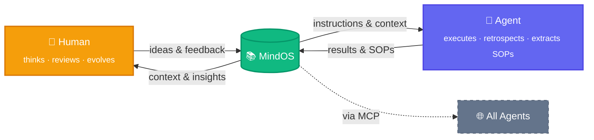

<p align="center">
  
</p>

<h1 align="center">MindOS</h1>

<p align="center">
  <strong>Human Thinks Here, Agent Acts There.</strong>
</p>

<p align="center">
  <a href="README.md">English</a> | <a href="README_zh.md">中文</a>
</p>

<p align="center">
  <a href="https://tianfuwang.tech/MindOS"></a>
  <a href="https://deepwiki.com/GeminiLight/MindOS"></a>
  <a href="LICENSE"></a>
</p>

MindOS is a **Human-AI Collaborative Mind System**—a local-first knowledge base that ensures your notes, workflows, and personal context are both human-readable and directly executable by AI Agents. **Globally sync your mind for all agents: transparent, controllable, and evolving symbiotically.**

---

<p align="center">
  <picture>
    <source media="(prefers-color-scheme: dark)" srcset="assets/images/demo-flow-dark.png" />
    <source media="(prefers-color-scheme: light)" srcset="assets/images/demo-flow-light.png" />
    
  </picture>
</p>

> [!IMPORTANT]
> **⭐ One-click install:** Send this to your Agent (Claude Code, Cursor, etc.) to set up everything automatically:
> ```
> Help me install MindOS from https://github.com/GeminiLight/MindOS with MCP and Skills. Use English template.
> ```
>
> **✨ Try it now:** After installation, give these a try:
> ```
> Read my MindOS knowledge base, see what's inside, then help me write my self-introduction into Profile.
> ```
> ```
> Help me distill the experience from this conversation into MindOS as a reusable SOP.
> ```
> ```
> Help me execute the XXX SOP from MindOS.
> ```

## 🧠 Core Value: Human-AI Shared Mind

**1. Global Sync — Break Mind Silos**

Traditional notes are scattered across tools and APIs, so agents miss your real context when it matters. MindOS turns your local knowledge into one MCP-ready source, so every agent can sync your Profile, SOPs, and live working memory.

**2. Transparent and Controllable — Eliminate Memory Black Boxes**

Most assistant memory lives in black boxes, leaving humans unable to inspect or correct how decisions are made. MindOS writes retrieval and execution traces into local plain text, so you can audit, intervene, and improve continuously.

**3. Symbiotic Evolution — Dynamic Instruction Flow**

Static documents are hard to synchronize and weak as execution systems in real human-agent collaboration. MindOS makes notes prompt-native and reference-linked, so daily writing naturally becomes executable workflows that evolve with you.

> **Foundation:** Local-first by default - all data stays in local plain text for privacy, ownership, and speed.

## ✨ Features

### For Humans

- **GUI Collaboration Workbench**: use one command entry to browse, edit, and search efficiently (`⌘K` / `⌘/`).
- **Built-in Agent Assistant**: converse in context while edits are captured into managed knowledge.
- **Plugin Views**: use scenario-focused views like TODO, Kanban, and Timeline.

### For Agents

- **MCP Server + Skills**: connect any compatible agent to read, write, search, and run workflows.
- **Structured Templates**: start quickly with Profile, Workflows, and Configurations scaffolds.
- **Experience Auto-Distillation**: automatically distill daily work into reusable, executable SOP experience.

### Infrastructure

- **Reference Sync**: keep cross-file status and context aligned via links/backlinks.
- **Knowledge Graph**: visualize relationships and dependencies across notes.
- **Git Time Machine**: track every edit, audit history, and roll back safely.

**Coming Soon:**

- [ ] ACP (Agent Communication Protocol): connect external Agents (e.g., Claude Code, Cursor) and turn the knowledge base into a multi-Agent collaboration hub
- [ ] Deep RAG integration: retrieval-augmented generation grounded in your knowledge base for more accurate, context-aware AI responses
- [ ] Backlinks View: display all files that reference the current file, helping you understand how a note fits into the knowledge network
- [ ] Agent Inspector: render Agent operation logs as a filterable timeline to audit every tool call in detail

---

## 🚀 Getting Started

> [!IMPORTANT]
> **Quick Start with Agent:** Paste this prompt into any MCP-capable Agent (Claude Code, Cursor, etc.) to install automatically, then skip to [Step 4](#4-inject-your-personal-mind-with-mindos-agent):
> ```
> Help me install MindOS from https://github.com/GeminiLight/MindOS with MCP and Skills. Use English template.
> ```

> Already have a knowledge base? Skip to [Step 5](#5-make-any-agent-ready-mcp--skills) to configure MCP + Skills.

### 1. Install

**Option A: npm (recommended)**

```bash
npm install -g @geminilight/mindos@latest
```

**Option B: Clone from source**

```bash
git clone https://github.com/GeminiLight/MindOS
cd MindOS
npm install
npm link   # registers the `mindos` command globally
```

### 2. Interactive Setup

```bash
mindos onboard --install-daemon  # setup + install & start as background OS service
```

The setup wizard will guide you through:
1. Knowledge base path → default `~/.mindos/my-mind`
2. Choose template language (en / zh)
3. Optional Auth token to protect your API
4. Configure AI Provider (Anthropic / OpenAI) + API Key — or choose **skip** to configure later via `mindos config set`
5. Config saved to `~/.mindos/config.json` automatically

<!-- For Agents: Before running setup, if the user has not provided LLM configuration, ask them:
1. AI Provider — `anthropic` or `openai` (compatible)?
2. API Key — the key for the chosen provider
3. Custom Base URL? — only needed for proxies or OpenAI-compatible endpoints; skip if using official API
4. Model ID — or use the default
Or skip the wizard and edit `~/.mindos/config.json` manually (see Config Reference below).
-->

<details>
<summary>Config Reference (~/.mindos/config.json)</summary>

```json
{
  "mindRoot": "~/.mindos/my-mind",
  "port": 3000,
  "mcpPort": 8787,
  "authToken": "",
  "webPassword": "",
  "ai": {
    "provider": "anthropic",
    "providers": {
      "anthropic": { "apiKey": "sk-ant-...", "model": "claude-sonnet-4-6" },
      "openai":    { "apiKey": "sk-...",     "model": "gpt-5.4", "baseUrl": "" }
    }
  }
}
```

| Field | Default | Description |
| :--- | :--- | :--- |
| `mindRoot` | `~/.mindos/my-mind` | **Required**. Absolute path to the knowledge base root. |
| `port` | `3000` | Optional. Web app port. |
| `mcpPort` | `8787` | Optional. MCP server port. |
| `authToken` | — | Optional. Protects App `/api/*` and MCP `/mcp` with bearer token auth. For Agent / MCP clients. Recommended when exposed to a network. |
| `webPassword` | — | Optional. Protects the web UI with a login page. For browser access. Independent from `authToken`. |
| `ai.provider` | `anthropic` | Active provider: `anthropic` or `openai`. |
| `ai.providers.anthropic.apiKey` | — | Anthropic API key. |
| `ai.providers.anthropic.model` | `claude-sonnet-4-6` | Anthropic model ID. |
| `ai.providers.openai.apiKey` | — | OpenAI API key. |
| `ai.providers.openai.model` | `gpt-5.4` | OpenAI model ID. |
| `ai.providers.openai.baseUrl` | — | Optional. Custom endpoint for proxy or OpenAI-compatible APIs. |

Multiple providers can be configured simultaneously — switch between them by changing `ai.provider`. Shell env vars (`ANTHROPIC_API_KEY`, `OPENAI_API_KEY`, etc.) take precedence over config file values.

</details>

> [!NOTE]
> If you want the MindOS GUI to be reachable from other devices, make sure the port is open in firewall/security-group settings and bound to an accessible host/network interface.

### 3. Run

```bash
mindos start    # start app + MCP server (production, auto-rebuilds when a new version is detected)
```

On startup, MindOS prints your Web UI URL, MCP config snippet, and auth token — ready to copy into your Agent.

> [!TIP]
> **Upgrading?** Run `mindos update` to install the latest version.

> [!TIP]
> If the port is already in use, set a different port during `mindos onboard` or update `~/.mindos/config.json`:
> ```bash
> MINDOS_WEB_PORT=3002 mindos
> ```

### 4. Inject Your Personal Mind with MindOS Agent

1. Open the built-in MindOS Agent chat panel in the GUI.
2. Upload your resume or any personal/project material.
3. Send this prompt: `Help me sync this information into my MindOS knowledge base.`

<p align="center">
  
</p>

### 5. Make Any Agent Ready (MCP + Skills)

#### 5.1 Configure MindOS MCP

<!-- For Agents: Register MindOS MCP as global (user-level) config by default, so all projects share the same knowledge base. -->

> [!TIP]
> Each Agent stores MCP config in a different file — see the **MCP Config Path** column in the [Supported Agents](#-supported-agents) table below for exact paths.

Register the MindOS MCP Server in your Agent client:

The MCP server starts automatically when you run `mindos start` or `mindos dev`. The MCP URL, auth token, and a ready-to-paste config snippet are printed on every startup.

> The MCP port defaults to `8787`. To use a different port, set `mcpPort` in `~/.mindos/config.json` via `mindos onboard`.

**Option A: Local (same machine)**

Via stdio — no server process needed:

```json
{
  "mcpServers": {
    "mindos": {
      "type": "stdio",
      "command": "mindos",
      "args": ["mcp"],
      "env": { "MCP_TRANSPORT": "stdio" }
    }
  }
}
```

Or via URL:

```json
{
  "mcpServers": {
    "mindos": {
      "url": "http://localhost:8787/mcp",
      "headers": { "Authorization": "Bearer your-token" }
    }
  }
}
```

**Option B: Remote URL (another device)**

> [!NOTE]
> Ensure port `8787` is open in your firewall/security-group so remote clients can reach the server.

```json
{
  "mcpServers": {
    "mindos": {
      "url": "http://<server-ip>:8787/mcp",
      "headers": { "Authorization": "Bearer your-token" }
    }
  }
}
```

#### 5.2 Install MindOS Skills

| Skill | Description |
|-------|-------------|
| `mindos` | Knowledge base operation guide (English) — read/write notes, search, manage SOPs, maintain Profiles |
| `mindos-zh` | Knowledge base operation guide (Chinese) — same capabilities, Chinese interface |

Install one skill only (choose based on your preferred language):

```bash
# English
npx skills add https://github.com/GeminiLight/MindOS --skill mindos -g -y

# Chinese (optional)
npx skills add https://github.com/GeminiLight/MindOS --skill mindos-zh -g -y
```

MCP = connection capability, Skills = workflow capability. Enabling both gives the complete MindOS agent experience.

#### 5.3 Common Pitfalls

- Only MCP, no Skills: tools are callable, but best-practice workflows are missing.
- Only Skills, no MCP: workflow guidance exists, but the Agent cannot operate your local knowledge base.
- `MIND_ROOT` is not an absolute path: MCP tool calls will fail.
- No `authToken` set: your API and MCP server are exposed on the network without protection.
- No `webPassword` set: anyone who can reach your server can access the web UI.

## ⚙️ How It Works

A fleeting idea becomes shared intelligence through three interlocking loops:



> **Both sides evolve.** Humans gain new insights from accumulated knowledge; Agents extract SOPs and get smarter. MindOS sits at the center — the shared second brain that grows with every interaction.

**Collaboration Loop (Human + Multi-Agent)**

1. Human reviews and updates notes/SOPs in the MindOS GUI (single source of truth).
2. Other Agent clients (OpenClaw, Claude Code, Cursor, etc.) connect through MCP and read the same memory/context.
3. With Skills enabled, those Agents execute workflows and SOP tasks in a guided way.
4. Execution results are written back to MindOS so humans can audit and refine continuously.

**Who is this for?**

- **AI Independent Developer** — Store personal SOPs, tech stack preferences, and project context in MindOS. Any Agent instantly inherits your work habits.
- **Knowledge Worker** — Manage research materials with bi-directional links. Your AI assistant answers questions grounded in your full context, not generic knowledge.
- **Team Collaboration** — Share a MindOS knowledge base across team members as a single source of truth. Humans and Agents read from the same playbook, keeping everyone aligned.
- **Automated Agent Operations** — Write standard workflows as Prompt-Driven documents. Agents execute directly, humans audit the results.

---

## 🤝 Supported Agents

| Agent | MCP | Skills | MCP Config Path |
|:------|:---:|:------:|:----------------|
| MindOS Agent | ✅ | ✅ | Built-in (no config needed) |
| OpenClaw | ✅ | ✅ | `~/.openclaw/openclaw.json` or `~/.openclaw/mcp.json` |
| Claude Desktop | ✅ | ✅ | macOS: `~/Library/Application Support/Claude/claude_desktop_config.json` |
| Claude Code | ✅ | ✅ | `~/.claude.json` (global) or `.mcp.json` (project) |
| CodeBuddy | ✅ | ✅ | `~/.claude-internal/.claude.json` (global) |
| Cursor | ✅ | ✅ | `~/.cursor/mcp.json` (global) or `.cursor/mcp.json` (project) |
| Windsurf | ✅ | ✅ | `~/.codeium/windsurf/mcp_config.json` |
| Cline | ✅ | ✅ | macOS: `~/Library/Application Support/Code/User/globalStorage/saoudrizwan.claude-dev/settings/cline_mcp_settings.json`; Linux: `~/.config/Code/User/globalStorage/saoudrizwan.claude-dev/settings/cline_mcp_settings.json` |
| Trae | ✅ | ✅ | `~/.trae/mcp.json` (global) or `.trae/mcp.json` (project) |
| Gemini CLI | ✅ | ✅ | `~/.gemini/settings.json` (global) or `.gemini/settings.json` (project) |
| GitHub Copilot | ✅ | ✅ | `.vscode/mcp.json` (project) or VS Code User `settings.json` (global) |
| iFlow | ✅ | ✅ | iFlow platform MCP configuration panel |

---

## 📁 Project Structure

```bash
MindOS/
├── app/              # Next.js 16 Frontend — Browse, edit, and interact with AI
├── mcp/              # MCP Server — HTTP adapter that maps tools to App API
├── skills/           # MindOS Skills (`mindos`, `mindos-zh`) — Workflow guides for Agents
├── templates/        # Preset templates (`en/`, `zh/`, `empty/`) — copied to knowledge base on onboard
├── bin/              # CLI entry point (`mindos onboard`, `mindos start`, `mindos dev`, `mindos token`)
├── scripts/          # Setup wizard and helper scripts
└── README.md

~/.mindos/            # User data directory (outside project, never committed)
├── config.json       # All configuration (AI keys, port, auth token, knowledge base path)
└── my-mind/          # Your private knowledge base (default path, customizable on onboard)
```

---

## ⌨️ CLI Commands

| Command | Description |
| :--- | :--- |
| `mindos onboard` | Interactive setup (config, template selection) |
| `mindos onboard --install-daemon` | Setup + install & start as background OS service |
| `mindos start` | Start app + MCP server (foreground, production mode) |
| `mindos start --daemon` | Install + start as a background OS service (survives terminal close, auto-restarts on crash) |
| `mindos dev` | Start app + MCP server (dev mode, hot reload) |
| `mindos dev --turbopack` | Dev mode with Turbopack (faster HMR) |
| `mindos stop` | Stop running MindOS processes |
| `mindos restart` | Stop then start again |
| `mindos build` | Manually build for production |
| `mindos mcp` | Start MCP server only |
| `mindos token` | Show current auth token and MCP config snippet |
| `mindos gateway install` | Install background service (systemd on Linux, LaunchAgent on macOS) |
| `mindos gateway uninstall` | Remove background service |
| `mindos gateway start` | Start the background service |
| `mindos gateway stop` | Stop the background service |
| `mindos gateway status` | Show background service status |
| `mindos gateway logs` | Tail background service logs |
| `mindos doctor` | Health check (config, ports, build, daemon status) |
| `mindos update` | Update MindOS to the latest version |
| `mindos logs` | Tail service logs (`~/.mindos/mindos.log`) |
| `mindos config show` | Print current config (API keys masked) |
| `mindos config validate` | Validate config file |
| `mindos config set <key> <val>` | Update a single config field |
| `mindos` | Start using the mode saved in `~/.mindos/config.json` |

---

## ⌨️ Keyboard Shortcuts

| Shortcut | Function |
| :--- | :--- |
| `⌘ + K` | Global Search |
| `⌘ + /` | Call AI Assistant / Sidebar |
| `E` | Press `E` in View mode to quickly enter Edit mode |
| `⌘ + S` | Save current edit |
| `Esc` | Cancel edit / Close dialog |

---

## 📄 License

MIT © GeminiLight
