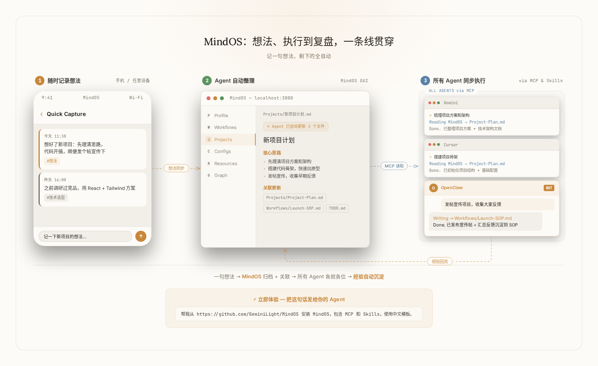
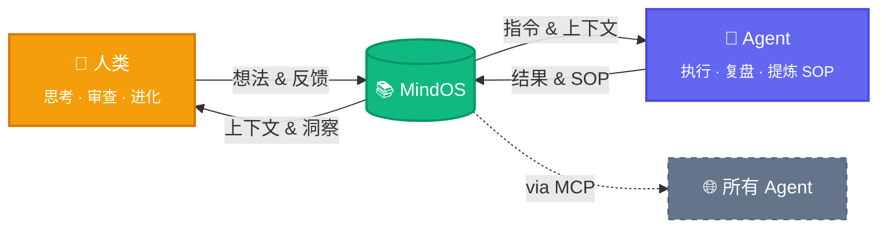

<p align="center">
  
</p>

<h1 align="center">MindOS</h1>

<p align="center">
  <strong>人类在此思考，Agent 依此行动。</strong>
</p>

<p align="center">
  <a href="README.md">English</a> | <a href="README_zh.md">中文</a>
</p>

<p align="center">
  <a href="https://tianfuwang.tech/MindOS"></a>
  <a href="https://github.com/GeminiLight/MindOS/releases/latest"></a>
  <a href="https://www.npmjs.com/package/@geminilight/mindos"></a>
  <a href="#wechat"></a>
  <a href="LICENSE"></a>
</p>

MindOS 是你思考的地方，也是 AI Agent 行动的起点——一个你和所有 AI 共享的本地知识库。**每次思考，都在生长。**

---

<p align="center">
  <picture>
    <source media="(prefers-color-scheme: dark)" srcset="assets/images/demo-flow-zh-dark.webp" type="image/webp" />
    <source media="(prefers-color-scheme: dark)" srcset="assets/images/demo-flow-zh-dark.png" />
    <source media="(prefers-color-scheme: light)" srcset="assets/images/demo-flow-zh-light.webp" type="image/webp" />
    <source media="(prefers-color-scheme: light)" srcset="assets/images/demo-flow-zh-light.png" />
    
  </picture>
</p>

<table>
  <tr>
    <td width="50%">
      <picture>
        <source srcset="assets/images/mindos-home.webp" type="image/webp" />
        
      </picture>
    </td>
    <td width="50%">
      <picture>
        <source srcset="assets/images/mindos-chat.webp" type="image/webp" />
        
      </picture>
    </td>
  </tr>
  <tr>
    <td align="center"><em>首页 — 知识库概览</em></td>
    <td align="center"><em>AI 对话 — 在上下文中与知识库对话</em></td>
  </tr>
  <tr>
    <td width="50%">
      <picture>
        <source srcset="assets/images/mindos-dashboard.webp" type="image/webp" />
        
      </picture>
    </td>
    <td width="50%">
      <picture>
        <source srcset="assets/images/mindos-echo.webp" type="image/webp" />
        
      </picture>
    </td>
  </tr>
  <tr>
    <td align="center"><em>Agent 工作台 — 管理所有已连接的 AI Agent</em></td>
    <td align="center"><em>Echo — 复盘与认知沉淀</em></td>
  </tr>
</table>

> [!IMPORTANT]
> **⭐ 一键安装：** 把这句话发给你的 Agent（Claude Code、Cursor 等），自动完成全部安装：
> ```
> 帮我从 https://github.com/GeminiLight/MindOS 安装 MindOS，包含 MCP 和 Skills，使用中文模板。
> ```
>
> **✨ 立即体验：** 安装完成后，不妨试试：
> ```
> 这是我的简历，读一下，把我的信息整理到 MindOS 里。
> ```
> ```
> 帮我把这次对话的经验沉淀到 MindOS，形成一个可复用的工作流。
> ```
> ```
> 帮我执行 MindOS 里的 XXX 工作流。
> ```

## 🧠 人机共享心智

> 你在思考中塑造 AI，AI 在执行中反哺你。人和 AI，在同一个大脑里共同成长。

**1. 全局同步 — 打破记忆割裂**

切换工具带来上下文割裂，个人深度背景散落各处，导致知识无法复用。**MindOS 内置 MCP Server，所有 Agent 零配置直连核心知识库。项目记忆与 SOP 仅需一处记录，全局赋能所有 AI 工具。**

**2. 透明可控 — 消除记忆黑箱**

Agent 记忆锁在黑箱中，推理无法审查，错误极难纠正且幻觉持续累积。**MindOS 将每次检索与执行沉淀为本地纯文本，提供完整的审查干预界面，人类拥有绝对的心智纠偏权，随时校准 Agent 行为。**

**3. 共生演进 — 经验回流为指令**

反复表达偏好但新对话又从零开始，思考未变成 AI 的能力与自身的方法论。**MindOS 将每次思考自动沉淀为知识库。在交互中厘清想法与标准，下次应对更默契拒绝重复犯错，认知随每次沉淀变得锐利。**

> **底层原则：** 默认本地优先，全部数据以本地纯文本保存，兼顾隐私、主权与性能。

---

## 🚀 快速开始

> [!IMPORTANT]
> **用 Agent 一键安装：** 将以下指令粘贴到任意支持 MCP 的 Agent（Claude Code、Cursor 等），即可自动完成安装，然后跳到[第 3 步](#3-通过-mindos-agent-注入你的个人心智)：
> ```
> 帮我从 https://github.com/GeminiLight/MindOS 安装 MindOS，包含 MCP 和 Skills，使用中文模板。
> ```

> 已有知识库？直接跳到[第 4 步](#4-让任意-agent-可用mcp--skills)配置 MCP + Skills。

### 1. 安装

**方式 A：桌面客户端（macOS / Windows / Linux）**

从[官网](https://tianfuwang.tech/MindOS/#quickstart)或 [GitHub Releases](https://github.com/GeminiLight/MindOS/releases/latest) 下载安装包，双击安装，无需终端。

**方式 B：npm 安装**

```bash
npm install -g @geminilight/mindos@latest
```

**方式 C：克隆源码**

```bash
git clone https://github.com/GeminiLight/MindOS
cd MindOS
npm install
npm link   # 将 mindos 命令注册为全局命令
```

### 2. 交互式配置

```bash
mindos onboard
```

配置向导会引导你完成知识库路径、模板、端口、认证、AI 服务商、启动模式等配置——所有选项都有合理默认值。配置自动保存到 `~/.mindos/config.json`。完整字段说明见 **[docs/zh/configuration.md](docs/zh/configuration.md)**。

> [!TIP]
> 选择"后台服务"模式可开机自启。随时运行 `mindos update` 升级到最新版本。

在浏览器中打开 Web UI：

```bash
mindos open
```

### 3. 通过 MindOS Agent 注入你的个人心智

1. 打开 MindOS GUI 中内置的 Agent 对话面板。
2. 上传你的简历或任意个人/项目资料。
3. 发送指令：`帮我把这些信息同步到我的 MindOS 知识库。`


### 4. 让任意 Agent 可用（MCP + Skills）

**MCP**（连接能力）— 一条命令自动安装：

```bash
mindos mcp install        # 交互式
mindos mcp install -g -y  # 一键全局安装
```

**Skills**（工作流能力）— 根据语言偏好选择其一：

```bash
npx skills add https://github.com/GeminiLight/MindOS --skill mindos -g -y      # 英文
npx skills add https://github.com/GeminiLight/MindOS --skill mindos-zh -g -y   # 中文
```

> 远程配置、手动 JSON 片段、常见误区等详见 **[docs/zh/supported-agents.md](docs/zh/supported-agents.md)**。

## ✨ 功能特性

**人类侧**

- **GUI 工作台**：浏览、编辑、搜索笔记，统一搜索 + AI 入口（`⌘K` / `⌘/`），专为人机共创设计。
- **内置 Agent 助手**：在上下文中与知识库对话，编辑无缝沉淀为可管理知识。
- **一键导入**：拖拽文件即可导入，Inline AI Organize 自动分析、分类、写入知识库，支持进度追踪和撤销。
- **新手引导**：首次使用的分步引导体验，帮助新用户快速搭建知识库并连接第一个 Agent。
- **插件扩展**：多种内置渲染器插件——TODO Board、CSV Views、Wiki Graph、Timeline、Workflow Editor、Agent Inspector 等。

**Agent 侧**

- **MCP Server + Skills**：stdio + HTTP 双传输，全阵容 Agent 兼容（Claude Code, Cursor, Gemini CLI 等），零配置接入。
- **ACP / A2A 协议**：Agent 间通信协议，支持 Agent 发现、任务委派与编排。Phase 1 已上线：Agent Card 发现 + JSON-RPC 消息通信。
- **Workflow 编排**：基于 YAML 的可视化工作流编辑器 + 步骤执行引擎，定义、编辑、运行多步 Agent 工作流。
- **结构化模板**：预置 Profile、Workflows、Configurations 等目录骨架，快速冷启动个人 Context。
- **笔记即指令**：日常笔记天然就是 Agent 可直接执行的高质量指令——无需额外格式转换，写下即可调度。

**基础设施**

- **安全防线**：Bearer Token 认证、路径沙箱、INSTRUCTION.md 写保护、原子写入。
- **知识图谱**：动态解析并可视化文件间的引用与依赖关系。
- **反向链接视图**：展示所有引用当前文件的反向链接，理解笔记在知识网络中的位置。
- **Agent 审计面板**：将 Agent 操作日志渲染为可筛选的时间线，审查每次工具调用的详情。
- **Git 时光机**：Git 自动同步（commit/push/pull），记录人类与 Agent 的每次编辑历史，一键回滚，跨设备同步。
- **桌面客户端**：原生 macOS/Windows/Linux 应用，系统托盘、开机自启、本地进程管理。

<details>
<summary><strong>即将到来</strong></summary>

- [ ] RAG 深度集成：基于知识库内容的检索增强生成，让 AI 回答更精准、更有上下文
- [ ] ACP / A2A Phase 2：深度多 Agent 协作，支持任务委派、共享上下文、工作流链式执行
- [ ] 经验编译器：从 Agent 交互中自动提取纠正和偏好，沉淀为可复用的 Skills/SOP
- [ ] 知识库健康度仪表盘：可视化认知复利指标——已积累规则数、Agent 复用次数、知识新鲜度

</details>

## ⚙️ 运作机制



> **双向进化。** 人类从积累的知识中获得新洞察；Agent 提炼 SOP 变得更强。MindOS 居中——随每次交互持续成长的共享第二大脑。

---

## 🤝 支持的 Agent

> 完整列表及 MCP 配置路径、手动配置方法：**[docs/zh/supported-agents.md](docs/zh/supported-agents.md)**

| Agent | MCP | Skills |
|:------|:---:|:------:|
| OpenClaw | ✅ | ✅ |
| Claude Code | ✅ | ✅ |
| Cursor | ✅ | ✅ |
| Codex | ✅ | ✅ |
| Gemini CLI | ✅ | ✅ |
| GitHub Copilot | ✅ | ✅ |
| Trae | ✅ | ✅ |
| CodeBuddy | ✅ | ✅ |
| Qoder | ✅ | ✅ |
| Cline | ✅ | ✅ |
| Windsurf | ✅ | ✅ |

---

## 📁 项目架构

```bash
MindOS/
├── app/              # Next.js 16 前端 — 浏览、编辑、与 AI 交互
├── mcp/              # MCP Server — 将工具映射到 App API 的 HTTP 适配器
├── skills/           # MindOS Skills（`mindos`、`mindos-zh`）— Agent 工作流指南
├── templates/        # 预设模板（`en/`、`zh/`、`empty/`）— onboard 时复制到知识库目录
├── bin/              # CLI（`mindos start`、`mindos file`、`mindos ask`、`mindos agent` 等）
├── scripts/          # 配置向导与辅助脚本
└── README.md

~/.mindos/            # 用户数据目录（项目外，不会被提交）
├── config.json       # 所有配置（AI 密钥、端口、Auth token、同步设置）
├── sync-state.json   # 同步状态（最后同步时间、冲突文件）
└── mind/             # 你的私有知识库（默认路径，onboard 时可自定义）
```

## ⌨️ CLI 命令

> 完整命令参考：**[docs/zh/cli-commands.md](docs/zh/cli-commands.md)**

| 命令 | 说明 |
| :--- | :--- |
| **核心** | |
| `mindos onboard` | 交互式初始化（生成配置、选择模板） |
| `mindos start` | 前台启动 app + MCP 服务 |
| `mindos start --daemon` | 以后台 OS 服务方式启动 |
| `mindos stop` / `restart` | 停止或重启服务 |
| `mindos dev` | 开发模式启动 |
| `mindos build` | 构建生产版本 |
| `mindos status` | 查看服务状态概览 |
| `mindos open` | 在浏览器中打开 Web UI |
| **知识库** | |
| `mindos file <sub>` | 文件操作（list, read, create, delete, search） |
| `mindos space <sub>` | 空间管理（list, create, info） |
| `mindos search "<query>"` | 搜索知识库 |
| `mindos ask "<question>"` | 基于知识库向 AI 提问 |
| `mindos agent <sub>` | AI Agent 管理（list, info） |
| `mindos api <METHOD> <path>` | API 透传（开发者/Agent 用） |
| **MCP 与配置** | |
| `mindos mcp install` | 自动将 MCP 配置写入 Agent |
| `mindos token` | 查看认证令牌和 MCP 配置 |
| `mindos config <sub>` | 查看/修改配置（show, set, validate） |
| `mindos sync` | 同步状态（init, now, conflicts, on/off） |
| `mindos gateway <sub>` | 管理后台服务（install, start, stop） |
| `mindos doctor` | 健康检查 |
| `mindos update` | 更新到最新版本 |

**主要快捷键：** `⌘K` 搜索 · `⌘/` AI 助手 · `E` 编辑 · `⌘S` 保存 · `Esc` 关闭 — 完整列表见 **[docs/zh/cli-commands.md](docs/zh/cli-commands.md)**。

---

## 💬 社区 <a name="wechat"></a>

加入微信内测群，抢先体验、反馈建议、交流 AI 工作流：

<p align="center">
  
</p>

> 扫码加入，或添加微信 **wtfly2018** 邀请入群。

---

## 👥 贡献者

<a href="https://github.com/GeminiLight"></a>
<a href="https://github.com/yeahjack"></a>
<a href="https://github.com/USTChandsomeboy"></a>
<a href="https://github.com/ppsmk388"></a>
<a href="https://github.com/U-rara"></a>
<a href="https://github.com/one2piece2hello"></a>
<a href="https://github.com/zz-haooo"></a>

### 🙏 致谢

本项目已在 [LINUX DO 社区](https://linux.do) 发布，感谢社区的支持与反馈。

---

## 📄 License

MIT © GeminiLight
