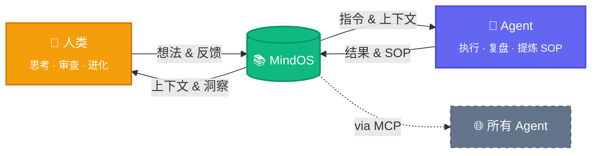

<p align="center">
  
  <br />
  <strong style="font-size: 2em;">MindOS</strong>
</p>

<p align="center">
  <strong>人类在此思考，Agent 依此行动。</strong>
</p>

<p align="center">
  <a href="README.md">English</a> | <a href="README_zh.md">中文</a>
</p>

<p align="center">
  <a href="https://deepwiki.com/GeminiLight/MindOS"></a>
  <a href="LICENSE"></a>
</p>

MindOS 是一个**人机协同心智系统**——基于本地优先的协作知识库，让你的笔记、工作流、个人上下文既对人类阅读友好，也能直接被 AI Agent 调用和执行。**为所有 Agents 全局同步你的心智，透明可控，共生演进。**

---

## 🧠 核心价值：人机共享心智

MindOS 通过以下三大支柱彻底重构人机协作范式，让人机在同一个 Shared Mind 中协作演进。

### 1. 全局同步 — 打破心智孤岛
*   **痛点：** 传统云端笔记管理繁琐、存在 API 壁垒，且灵感捕获成本高，导致 Agent 难以稳定读取人类的深度背景与瞬间顿悟。
*   **跃迁：** 一处记录，全量赋能。MindOS 提供极致轻量的 Web 捕获入口，并内置标准 MCP Server。任何支持协议的 Agent 均可无缝读取你的 Profile、SOP 与过往经验，实现个人 Context 的“开箱即用”与心智的实时对齐。

### 2. 透明可控 — 消除 Agent 黑箱
*   **痛点：** 现有 AI 助手的“记忆”锁在系统黑箱中，人类无法直观查看或纠正 Agent 的中间思考过程，容易产生不受控的幻觉。
*   **跃迁：** 让 Agent 在阳光下思考。Agent 的每一次检索、反思与执行，均通过 MCP 直接沉淀为本地纯文本（Markdown/CSV）。人类在直观的 GUI 工作台中拥有绝对的审查、干预与心智修正权。

### 3. 共生演进 — 动态指令流转
*   **痛点：** 传统的文档管理层级深、同步难，难以在复杂的人机协作任务中作为“执行引擎”流转。
*   **跃迁：** 知识库即代码。通过 Prompt-Native 的记录范式与引用驱动的自动同步，你的日常笔记天然就是高质量的 Agent 执行指令。让人机在同一个 Shared Mind 中相互启发，共同迭代生长。

> **底层基石：** 坚持 **本地优先** 原则。所有数据以纯文本形式存储在本地，彻底消除隐私顾虑，确保你拥有绝对的数据主权与极致的读写性能。

---

## ✨ 功能特性

### 人类侧

*   **GUI 工作台** — 浏览、编辑、搜索笔记，统一搜索 + AI 入口（`⌘K` / `⌘/`），专为人机共创设计。
*   **内置 Agent 助手** — 在上下文中与知识库对话，Agent 管理文件，编辑无缝沉淀人类主动管理的知识。
*   **插件扩展** — 针对特定场景的自定义视图插件（TODO 列表、看板、时间线等），实现弹性知识管理。

### Agent 侧

*   **MCP Server & Skills** — 将知识库暴露为标准 MCP 工具集，任意 Agent 零配置接入，读写、搜索及执行本地工作流。
*   **结构化模板** — 预置 Profile、Workflows、Configurations 等目录骨架，快速冷启动个人 Context。
*   **Prompt-Driven 文档管理** — 以 Prompt 思维组织文档结构与内容，人类的日常笔记即 Agent 可直接执行的高质量指令。

### 基础设施

*   **引用驱动同步** — 通过引用与双链关联，实现项目状态、任务进度与上下文的跨文件自动同步流转。
*   **可视化知识图谱** — 动态解析并可视化文件间的引用与依赖关系，直观管理人机上下文网络。
*   **时光机与版本控制** — 自动记录人类与 Agent 的每次编辑历史，一键回滚，可视化 Context 演变与推理轨迹。

**即将到来：**

- [ ] ACP（Agent Communication Protocol）：连接外部 Agent（如 Claude Code、Cursor），让知识库成为多 Agent 协作的中枢
- [ ] RAG 深度集成：基于知识库内容的检索增强生成，让 AI 回答更精准、更有上下文
- [ ] 反向链接视图（Backlinks）：展示所有引用当前文件的反向链接，理解笔记在知识网络中的位置
- [ ] Agent 审计面板（Agent Inspector）：将 Agent 操作日志渲染为可筛选的时间线，审查每次工具调用的详情
- [ ] 工作流执行器（Workflow Runner）：将 SOP/Workflow 文档渲染为可交互的分步执行面板，一键让 AI 执行每个步骤
- [ ] Agent Diff 审阅器：将 Agent 的文件修改渲染为逐行对比视图，支持一键批准或回滚

---

## 🚀 快速开始

### 1. 安装与启动

```bash
# 克隆项目
git clone https://github.com/GeminiLight/MindOS
cd MindOS

# 从预设模板初始化你的知识库
cp -r template/zh my-mind/
# 或使用英文预设：
# cp -r template/en my-mind/

# 配置环境变量
cp app/.env.example app/.env.local
# 编辑 MIND_ROOT，指向你的 my-mind/ 绝对路径

# 启动应用
cd app && npm install && npm run dev
```

打开 [http://localhost:3000](http://localhost:3000) 即可开始使用。

### 2. 环境变量

在 `app/.env.local` 中配置：

```env
MIND_ROOT=/path/to/MindOS/my-mind
AI_PROVIDER=anthropic
ANTHROPIC_API_KEY=sk-ant-...
# OPENAI_API_KEY=sk-proj-...
# OPENAI_BASE_URL=https://api.openai.com/v1
ANTHROPIC_MODEL=claude-3-7-sonnet-20250219
```

| 变量 | 默认值 | 说明 |
| :--- | :--- | :--- |
| `MIND_ROOT` | — | **必填**。知识库根目录的绝对路径 |
| `AI_PROVIDER` | `anthropic` | 可选 `anthropic` 或 `openai` |
| `ANTHROPIC_API_KEY` | — | 当 Provider 为 `anthropic` 时必填 |
| `OPENAI_API_KEY` | — | 当 Provider 为 `openai` 时必填 |
| `OPENAI_BASE_URL` | — | 可选。用于代理或 OpenAI 兼容 API 的自定义接口地址 |

### 3. 接入你的 Agent（MCP）

将 MindOS MCP Server 注册到你的 Agent 客户端，即可让 Agent 直接访问和操作你的本地知识库。

**配置示例（Claude Desktop）：**

```json
{
  "mcpServers": {
    "mindos": {
      "type": "stdio",
      "command": "node",
      "args": ["/path/to/MindOS/mcp/dist/index.js"],
      "env": {
        "MIND_ROOT": "/path/to/MindOS/my-mind"
      }
    }
  }
}
```

**构建 MCP Server：**
```bash
cd mcp && npm install && npm run build
```

### 4. 安装 MindOS Skills

| Skill | 说明 |
|-------|------|
| `mindos` | 知识库操作指南（英文）— 读写笔记、搜索、管理 SOP、维护 Profile |
| `mindos-zh` | 知识库操作指南（中文）— 相同能力，中文交互 |

推荐安装格式：

```bash
npx skills add <owner/repo> --skill <skill-name>
```

示例（官方社区常见格式）：

```bash
npx skills add https://github.com/microsoft/skills --skill azure-diagnostics
```

安装 MindOS Skills：

```bash
npx skills add https://github.com/GeminiLight/mindos-dev --skill mindos
npx skills add https://github.com/GeminiLight/mindos-dev --skill mindos-zh
```


---

## ⚙️ 运作机制

一个零散想法如何变成所有 Agent 共享的智慧——三个联动飞轮：



> **双向进化。** 人类从积累的知识中获得新洞察；Agent 提炼 SOP 变得更强。MindOS 居中——随每次交互持续成长的共享第二大脑。

**适用人群：**

- **AI 独立开发者** — 将个人 SOP、技术栈偏好、项目上下文存入 MindOS，任何 Agent 即插即用你的工作习惯。
- **知识工作者** — 用双链笔记管理研究资料，AI 助手基于你的完整上下文回答问题，而非泛泛而谈。
- **团队协作** — 团队成员共享同一个 MindOS 知识库作为 Single Source of Truth，人与 Agent 读同一份剧本，保持对齐。
- **Agent 自动运维** — 将标准流程写成 Prompt-Driven 文档，Agent 直接执行，人类审计结果。

---

## 🤝 支持的 Agent

| Agent | MCP | Skills |
|:------|:---:|:------:|
| OpenClaw | ✅ | ✅ |
| Claude Desktop | ✅ | ✅ |
| Claude Code | ✅ | ✅ |
| CodeBuddy | ✅ | ✅ |
| Cursor | ✅ | ✅ |
| Windsurf | ✅ | ✅ |
| Cline | ✅ | ✅ |
| Trae | ✅ | ✅ |
| Gemini CLI | ✅ | ✅ |
| GitHub Copilot | ✅ | ✅ |

---

## 📁 项目架构

```bash
MindOS/
├── app/              # Next.js 15 前端 — 浏览、编辑、与 AI 交互
├── mcp/              # MCP Server 核心 — 暴露给 Agent 的标准化工具集
├── template/         # 预设模板（`en/`、`zh/`）— 选择其一复制到 my-mind/
├── my-mind/          # 你的私有共享内存（已加入 .gitignore，确保隐私）
├── SERVICES.md       # 技术与服务架构总览
└── README.md
```

---

## ⌨️ 快捷键指南

| 快捷键 | 功能 |
| :--- | :--- |
| `⌘ + K` | 全局搜索知识库 |
| `⌘ + /` | 唤起 AI 问答 / 侧边栏 |
| `E` | 在阅读界面按 `E` 快速进入编辑模式 |
| `⌘ + S` | 保存当前编辑 |
| `Esc` | 取消编辑 / 关闭弹窗 |

---

## 📄 License

MIT © GeminiLight
