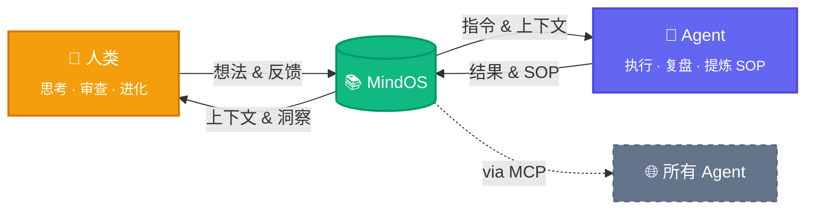

<p align="center">
  
</p>

<h1 align="center">MindOS</h1>

<p align="center">
  <strong>人类在此思考，Agent 依此行动。</strong>
</p>

<p align="center">
  <a href="README.md">English</a> | <a href="README_zh.md">中文</a>
</p>

<p align="center">
  <a href="https://tianfuwang.tech/MindOS"></a>
  <a href="https://deepwiki.com/GeminiLight/MindOS"></a>
  <a href="LICENSE"></a>
</p>

MindOS 是一个**人机协同心智系统**——基于本地优先的协作知识库，让你的笔记、工作流、个人上下文既对人类阅读友好，也能直接被 AI Agent 调用和执行。**为所有 Agents 全局同步你的心智，透明可控，共生演进。**

---

<p align="center">
  <picture>
    <source media="(prefers-color-scheme: dark)" srcset="assets/images/demo-flow-zh-dark.png" />
    <source media="(prefers-color-scheme: light)" srcset="assets/images/demo-flow-zh-light.png" />
    
  </picture>
</p>

> [!IMPORTANT]
> **⭐ 一键安装：** 把这句话发给你的 Agent（Claude Code、Cursor 等），自动完成全部安装：
> ```
> 帮我从 https://github.com/GeminiLight/MindOS 安装 MindOS，包含 MCP 和 Skills，使用中文模板。
> ```
>
> **✨ 立即体验：** 安装完成后，不妨试试：
> ```
> 读一下我的 MindOS 知识库，看看里面有什么，然后帮我把自我介绍写进 Profile。
> ```
> ```
> 帮我把这次对话的经验沉淀到 MindOS，形成一个可复用的工作流。
> ```
> ```
> 帮我执行 MindOS 里的 XXX 工作流。
> ```

## 🧠 核心价值：人机共享心智

**1. 全局同步 — 打破心智孤岛**

传统笔记分散在不同工具和接口中，Agent 在关键时刻拿不到你的真实上下文。MindOS 把本地知识统一为 MCP 可读的单一来源，让所有 Agent 同步你的 Profile、SOP 与实时记忆。

**2. 透明可控 — 消除记忆黑箱**

多数助手记忆封闭在黑箱里，人类难以审查和纠正决策过程。MindOS 将检索与执行轨迹沉淀为本地纯文本，让你可以持续审计、干预与优化。

**3. 共生演进 — 动态指令流转**

静态文档难同步，也难在真实人机协作中承担执行系统角色。MindOS 以 Prompt-Native 与引用链接组织知识，让日常记录自然变成可执行工作流并持续进化。

> **底层原则：** 默认本地优先，全部数据以本地纯文本保存，兼顾隐私、主权与性能。

## ✨ 功能特性

### 人类侧

- **GUI 协作工作台**：以统一入口高效浏览、编辑与搜索（`⌘K` / `⌘/`）。
- **内置 Agent 助手**：在上下文中对话，编辑内容可持续沉淀为可管理知识。
- **插件视图**：按场景使用 TODO、看板、时间线等视图。

### Agent 侧

- **MCP Server + Skills**：让兼容 Agent 统一接入读写、搜索与工作流执行。
- **结构化模板**：通过 Profile、Workflows、Configurations 快速冷启动。
- **经验自动沉淀**：将日常记录自动化沉淀为可执行 SOP 经验。

### 基础设施

- **引用同步**：通过引用与反向链接保持跨文件状态一致。
- **知识图谱**：可视化笔记间关系与依赖。
- **Git 时光机**：记录修改历史，支持审计与安全回滚。

**即将到来：**

- [ ] ACP（Agent Communication Protocol）：连接外部 Agent（如 Claude Code、Cursor），让知识库成为多 Agent 协作的中枢
- [ ] RAG 深度集成：基于知识库内容的检索增强生成，让 AI 回答更精准、更有上下文
- [ ] 反向链接视图（Backlinks）：展示所有引用当前文件的反向链接，理解笔记在知识网络中的位置
- [ ] Agent 审计面板（Agent Inspector）：将 Agent 操作日志渲染为可筛选的时间线，审查每次工具调用的详情

---

## 🚀 快速开始

> [!IMPORTANT]
> **用 Agent 一键安装：** 将以下指令粘贴到任意支持 MCP 的 Agent（Claude Code、Cursor 等），即可自动完成安装，然后跳到[第 4 步](#4-通过-mindos-agent-注入你的个人心智)：
> ```
> 帮我从 https://github.com/GeminiLight/MindOS 安装 MindOS，包含 MCP 和 Skills，使用中文模板。
> ```

> 已有知识库？直接跳到[第 5 步](#5-让任意-agent-可用mcp--skills)配置 MCP + Skills。

### 1. 安装

**方式 A：npm 安装（推荐）**

```bash
npm install -g @geminilight/mindos@latest
```

**方式 B：克隆源码**

```bash
git clone https://github.com/GeminiLight/MindOS
cd MindOS
npm install
npm link   # 将 mindos 命令注册为全局命令
```

### 2. 交互式配置

```bash
mindos onboard --install-daemon  # 初始化 + 安装并启动后台服务
```

配置向导将引导你完成：
1. 知识库路径 → 默认 `~/.mindos/my-mind`
2. 选择模板语言（en / zh / empty）
3. 可选 Auth token，保护你的 API
4. 配置 AI Provider（Anthropic / OpenAI）+ API Key — 或选择 **skip**，稍后通过 `mindos config set` 补填
5. 配置自动保存到 `~/.mindos/config.json`

<!-- For Agents: 运行 onboard 前，如果用户未提供 LLM 配置，请询问：
1. AI Provider — `anthropic` 还是 `openai`（兼容）？
2. API Key — 对应 Provider 的密钥
3. 自定义 Base URL？— 仅代理或 OpenAI 兼容端点需要；使用官方 API 则跳过
4. Model ID — 或使用默认值
或跳过向导，手动编辑 `~/.mindos/config.json`（参考下方配置参考）。
-->

<details>
<summary>配置参考（~/.mindos/config.json）</summary>

```json
{
  "mindRoot": "~/.mindos/my-mind",
  "port": 3000,
  "mcpPort": 8787,
  "authToken": "",
  "webPassword": "",
  "ai": {
    "provider": "anthropic",
    "providers": {
      "anthropic": { "apiKey": "sk-ant-...", "model": "claude-sonnet-4-6" },
      "openai":    { "apiKey": "sk-...",     "model": "gpt-5.4", "baseUrl": "" }
    }
  }
}
```

| 字段 | 默认值 | 说明 |
| :--- | :--- | :--- |
| `mindRoot` | `~/.mindos/my-mind` | **必填**。知识库根目录的绝对路径 |
| `port` | `3000` | 可选。Web 服务端口 |
| `mcpPort` | `8787` | 可选。MCP 服务端口 |
| `authToken` | — | 可选。保护 App `/api/*` 和 MCP `/mcp` 的 Bearer Token 认证。供 Agent / MCP 客户端使用，暴露到网络时建议设置 |
| `webPassword` | — | 可选。为 Web UI 添加登录密码保护。供浏览器访问，与 `authToken` 相互独立 |
| `ai.provider` | `anthropic` | 当前使用的 provider：`anthropic` 或 `openai` |
| `ai.providers.anthropic.apiKey` | — | Anthropic API Key |
| `ai.providers.anthropic.model` | `claude-sonnet-4-6` | Anthropic 模型 ID |
| `ai.providers.openai.apiKey` | — | OpenAI API Key |
| `ai.providers.openai.model` | `gpt-5.4` | OpenAI 模型 ID |
| `ai.providers.openai.baseUrl` | — | 可选。用于代理或 OpenAI 兼容 API 的自定义接口地址 |

多个 provider 可以同时配置，切换时只需修改 `ai.provider` 字段，无需重新填写 API Key。Shell 环境变量（`ANTHROPIC_API_KEY`、`OPENAI_API_KEY` 等）优先级高于配置文件。

</details>

> [!NOTE]
> 如果你希望其他设备也能访问 MindOS GUI，请确保端口已在防火墙/安全组中放行，并绑定到可访问的主机地址/网卡。

### 3. 启动

```bash
mindos start    # 启动 app + MCP 服务（生产模式，检测到新版本时自动重新构建）
```

启动后，MindOS 会自动打印 Web UI 地址、MCP 配置片段和 Auth token，直接复制到你的 Agent 即可。

> [!TIP]
> **升级？** 运行 `mindos update` 安装最新版本。

> [!TIP]
> 如果端口被占用，在 `mindos onboard` 时指定其他端口，或更新 `~/.mindos/config.json`，也可通过环境变量临时覆盖：
> ```bash
> MINDOS_WEB_PORT=3002 mindos
> ```

### 4. 通过 MindOS Agent 注入你的个人心智

1. 打开 MindOS GUI 中内置的 Agent 对话面板。
2. 上传你的简历或任意个人/项目资料。
3. 发送指令：`帮我把这些信息同步到我的 MindOS 知识库。`

<p align="center">
  
</p>

### 5. 让任意 Agent 可用（MCP + Skills）

#### 5.1 配置 MindOS MCP

<!-- For Agents: MindOS MCP 默认注册为全局（user-level）配置，使所有项目共享同一知识库。-->

> [!TIP]
> 每个 Agent 的 MCP 配置文件路径不同——详见下方 [支持的 Agent](#-支持的-agent) 表格中的 **MCP 配置文件路径** 列。

将 MindOS MCP Server 注册到你的 Agent 客户端：

运行 `mindos start` 或 `mindos dev` 时，MCP 服务自动随之启动。每次启动都会打印 MCP URL、Auth token 及可直接粘贴的配置片段。

> MCP 端口默认为 `8787`。如需修改，通过 `mindos onboard` 设置 `~/.mindos/config.json` 中的 `mcpPort`。

**方式 A：本机（同一台机器）**

通过 stdio — 无需启动服务进程：

```json
{
  "mcpServers": {
    "mindos": {
      "type": "stdio",
      "command": "mindos",
      "args": ["mcp"],
      "env": { "MCP_TRANSPORT": "stdio" }
    }
  }
}
```

或通过 URL：

```json
{
  "mcpServers": {
    "mindos": {
      "url": "http://localhost:8787/mcp",
      "headers": { "Authorization": "Bearer your-token" }
    }
  }
}
```

**方式 B：远程 URL（其他设备）**

> [!NOTE]
> 请确保端口 `8787` 已在防火墙/安全组中放行，远程客户端才能连接。

```json
{
  "mcpServers": {
    "mindos": {
      "url": "http://<服务器IP>:8787/mcp",
      "headers": { "Authorization": "Bearer your-token" }
    }
  }
}
```

#### 5.2 安装 MindOS Skills

| Skill | 说明 |
|-------|------|
| `mindos` | 知识库操作指南（英文）— 读写笔记、搜索、管理 SOP、维护 Profile |
| `mindos-zh` | 知识库操作指南（中文）— 相同能力，中文交互 |

根据你的语言偏好选择其一安装即可：

```bash
# 英文
npx skills add https://github.com/GeminiLight/MindOS --skill mindos -g -y

# 中文（可选）
npx skills add https://github.com/GeminiLight/MindOS --skill mindos-zh -g -y
```

MCP = 连接能力，Skills = 工作流能力；两者都开启后体验完整。

#### 5.3 常见误区

- 只配 MCP，不装 Skills：能调用工具，但缺少最佳实践指引。
- 只装 Skills，不配 MCP：有流程提示，但无法操作本地知识库。
- `MIND_ROOT` 不是绝对路径：MCP 工具调用会失败。
- 未设置 `authToken`：API 和 MCP 服务暴露在网络上，存在安全风险。
- 未设置 `webPassword`：任何能访问服务器的人都可以打开 Web UI。

## ⚙️ 运作机制

一个零散想法如何变成所有 Agent 共享的智慧——三个联动飞轮：



> **双向进化。** 人类从积累的知识中获得新洞察；Agent 提炼 SOP 变得更强。MindOS 居中——随每次交互持续成长的共享第二大脑。

**协作闭环（人类 + 多 Agent）**

1. 人类在 MindOS GUI 中审阅并更新笔记/SOP（单一事实来源）。
2. 其他 Agent 客户端（OpenClaw、Claude Code、Cursor 等）通过 MCP 读取同一份记忆与上下文。
3. 启用 Skills 后，Agent 按工作流指引执行任务与 SOP。
4. 执行结果回写到 MindOS，供人类持续审查与迭代。

**适用人群：**

- **AI 独立开发者** — 将个人 SOP、技术栈偏好、项目上下文存入 MindOS，任何 Agent 即插即用你的工作习惯。
- **知识工作者** — 用双链笔记管理研究资料，AI 助手基于你的完整上下文回答问题，而非泛泛而谈。
- **团队协作** — 团队成员共享同一个 MindOS 知识库作为 Single Source of Truth，人与 Agent 读同一份剧本，保持对齐。
- **Agent 自动运维** — 将标准流程写成 Prompt-Driven 文档，Agent 直接执行，人类审计结果。

---

## 🤝 支持的 Agent

| Agent | MCP | Skills | MCP 配置文件路径 |
|:------|:---:|:------:|:-----------------|
| MindOS Agent | ✅ | ✅ | 内置（无需配置） |
| OpenClaw | ✅ | ✅ | `~/.openclaw/openclaw.json` 或 `~/.openclaw/mcp.json` |
| Claude Desktop | ✅ | ✅ | macOS: `~/Library/Application Support/Claude/claude_desktop_config.json` |
| Claude Code | ✅ | ✅ | `~/.claude.json`（全局）或 `.mcp.json`（项目级） |
| CodeBuddy | ✅ | ✅ | `~/.claude-internal/.claude.json`（全局） |
| Cursor | ✅ | ✅ | `~/.cursor/mcp.json`（全局）或 `.cursor/mcp.json`（项目级） |
| Windsurf | ✅ | ✅ | `~/.codeium/windsurf/mcp_config.json` |
| Cline | ✅ | ✅ | macOS: `~/Library/Application Support/Code/User/globalStorage/saoudrizwan.claude-dev/settings/cline_mcp_settings.json`；Linux: `~/.config/Code/User/globalStorage/saoudrizwan.claude-dev/settings/cline_mcp_settings.json` |
| Trae | ✅ | ✅ | `~/.trae/mcp.json`（全局）或 `.trae/mcp.json`（项目级） |
| Gemini CLI | ✅ | ✅ | `~/.gemini/settings.json`（全局）或 `.gemini/settings.json`（项目级） |
| GitHub Copilot | ✅ | ✅ | `.vscode/mcp.json`（项目级）或 VS Code 用户 `settings.json`（全局） |
| iFlow | ✅ | ✅ | iFlow 平台 MCP 配置面板 |

---

## 📁 项目架构

```bash
MindOS/
├── app/              # Next.js 16 前端 — 浏览、编辑、与 AI 交互
├── mcp/              # MCP Server — 将工具映射到 App API 的 HTTP 适配器
├── skills/           # MindOS Skills（`mindos`、`mindos-zh`）— Agent 工作流指南
├── templates/        # 预设模板（`en/`、`zh/`、`empty/`）— onboard 时复制到知识库目录
├── bin/              # CLI 入口（`mindos onboard`、`mindos start`、`mindos dev`、`mindos token`）
├── scripts/          # 配置向导与辅助脚本
└── README.md

~/.mindos/            # 用户数据目录（项目外，不会被提交）
├── config.json       # 所有配置（AI 密钥、端口、Auth token、知识库路径）
└── my-mind/          # 你的私有知识库（默认路径，onboard 时可自定义）
```

---

## ⌨️ CLI 命令

| 命令 | 说明 |
| :--- | :--- |
| `mindos onboard` | 交互式初始化（生成配置、选择模板） |
| `mindos onboard --install-daemon` | 初始化 + 安装并启动后台服务 |
| `mindos start` | 前台启动 app + MCP 服务（生产模式） |
| `mindos start --daemon` | 安装并以后台 OS 服务方式启动（关闭终端仍运行，崩溃自动重启） |
| `mindos dev` | 启动 app + MCP 服务（开发模式，热更新） |
| `mindos dev --turbopack` | 开发模式 + Turbopack（更快的 HMR） |
| `mindos stop` | 停止正在运行的 MindOS 进程 |
| `mindos restart` | 停止后重新启动 |
| `mindos build` | 手动构建生产版本 |
| `mindos mcp` | 仅启动 MCP 服务 |
| `mindos token` | 查看当前 Auth token 及 MCP 配置片段 |
| `mindos gateway install` | 安装后台服务（Linux 用 systemd，macOS 用 LaunchAgent） |
| `mindos gateway uninstall` | 卸载后台服务 |
| `mindos gateway start` | 启动后台服务 |
| `mindos gateway stop` | 停止后台服务 |
| `mindos gateway status` | 查看后台服务状态 |
| `mindos gateway logs` | 实时查看服务日志 |
| `mindos doctor` | 健康检查（配置、端口、构建、daemon 状态） |
| `mindos update` | 更新 MindOS 到最新版本 |
| `mindos logs` | 实时查看服务日志（`~/.mindos/mindos.log`） |
| `mindos config show` | 查看当前配置（API Key 脱敏显示） |
| `mindos config validate` | 验证配置文件 |
| `mindos config set <key> <val>` | 更新单个配置字段 |
| `mindos` | 使用 `~/.mindos/config.json` 中保存的模式启动 |

---

## ⌨️ 快捷键指南

| 快捷键 | 功能 |
| :--- | :--- |
| `⌘ + K` | 全局搜索知识库 |
| `⌘ + /` | 唤起 AI 问答 / 侧边栏 |
| `E` | 在阅读界面按 `E` 快速进入编辑模式 |
| `⌘ + S` | 保存当前编辑 |
| `Esc` | 取消编辑 / 关闭弹窗 |

---

## 📄 License

MIT © GeminiLight
