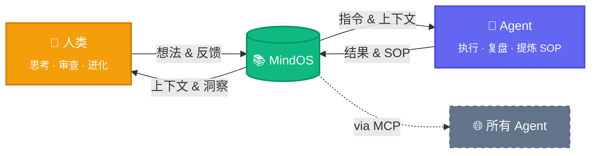

<p align="center">
  
  <br />
  <strong style="font-size: 4em;">MindOS</strong>
</p>

<p align="center">
  <strong>人类在此思考，Agent 依此行动。</strong>
</p>

<p align="center">
  <a href="README.md">English</a> | <a href="README_zh.md">中文</a>
</p>

<p align="center">
  <a href="https://github.com/GeminiLight/MindOS"></a>
  <a href="https://deepwiki.com/GeminiLight/MindOS"></a>
  <a href="LICENSE"></a>
</p>

MindOS 是一个**人机协同心智系统**——基于本地优先的协作知识库，让你的笔记、工作流、个人上下文既对人类阅读友好，也能直接被 AI Agent 调用和执行。**为所有 Agents 全局同步你的心智，透明可控，共生演进。**

---

## 🧠 核心价值：人机共享心智

### 1. 全局心智同步
传统笔记分散在不同工具和接口中，Agent 在关键时刻拿不到你的真实上下文。MindOS 把本地知识统一为 MCP 可读的单一来源，让所有 Agent 同步你的 Profile、SOP 与实时记忆。

### 2. 透明可控
多数助手记忆封闭在黑箱里，人类难以审查和纠正决策过程。MindOS 将检索与执行轨迹沉淀为本地纯文本，让你可以持续审计、干预与优化。

### 3. 共生演进
静态文档难同步，也难在真实人机协作中承担执行系统角色。MindOS 以 Prompt-Native 与引用链接组织知识，让日常记录自然变成可执行工作流并持续进化。

> **底层原则：** 默认本地优先，全部数据以本地纯文本保存，兼顾隐私、主权与性能。

## ✨ 功能特性

### 人类侧

- **GUI 协作工作台**：以统一入口高效浏览、编辑与搜索（`⌘K` / `⌘/`）。
- **内置 Agent 助手**：在上下文中对话，编辑内容可持续沉淀为可管理知识。
- **插件视图**：按场景使用 TODO、看板、时间线等视图。

### Agent 侧

- **MCP Server + Skills**：让兼容 Agent 统一接入读写、搜索与工作流执行。
- **结构化模板**：通过 Profile、Workflows、Configurations 快速冷启动。
- **经验自动沉淀**：将日常记录自动化沉淀为可执行 SOP 经验。

### 基础设施

- **引用同步**：通过引用与反向链接保持跨文件状态一致。
- **知识图谱**：可视化笔记间关系与依赖。
- **Git 时光机**：记录修改历史，支持审计与安全回滚。

> 完整愿景文档见：[wiki-zh/product-vision.md](wiki-zh/product-vision.md) 与 [wiki-zh/product-vision-zh.md](wiki-zh/product-vision-zh.md)。
**即将到来：**

- [ ] ACP（Agent Communication Protocol）：连接外部 Agent（如 Claude Code、Cursor），让知识库成为多 Agent 协作的中枢
- [ ] RAG 深度集成：基于知识库内容的检索增强生成，让 AI 回答更精准、更有上下文
- [ ] 反向链接视图（Backlinks）：展示所有引用当前文件的反向链接，理解笔记在知识网络中的位置
- [ ] Agent 审计面板（Agent Inspector）：将 Agent 操作日志渲染为可筛选的时间线，审查每次工具调用的详情
- [ ] 工作流执行器（Workflow Runner）：将 SOP/Workflow 文档渲染为可交互的分步执行面板，一键让 AI 执行每个步骤
- [ ] Agent Diff 审阅器：将 Agent 的文件修改渲染为逐行对比视图，支持一键批准或回滚

---

## 🚀 快速开始

> [!IMPORTANT]
> 如果你已经配置好了本地的知识库，请跳过安装与环境变量配置环节。
> 你只在各类 Agent（OpenClaw/ Claude Code/Cursor 等）工具中需要完成两步：
> 1) 配置 MindOS MCP
> 2) 安装 MindOS Skills
> 完成后，Agent 就可以同步你的心智，管理你的知识库和执行 SOP。

### 1. 安装与启动

```bash
# 克隆项目
git clone https://github.com/GeminiLight/MindOS
cd MindOS

# 从预设模板初始化你的知识库
cp -r template/zh my-mind/
# 或使用英文预设：
# cp -r template/en my-mind/

# 配置环境变量
cp app/.env.example app/.env.local
# 编辑 MIND_ROOT，指向你的 my-mind/ 绝对路径

# 启动应用
cd app && npm install && npm run dev
```

打开 [http://localhost:3000](http://localhost:3000) 即可开始使用。

### 2. 环境变量

在 `app/.env.local` 中配置：

```env
MIND_ROOT=/path/to/MindOS/my-mind
MINDOS_WEB_PORT=3000
AI_PROVIDER=anthropic
ANTHROPIC_API_KEY=sk-ant-...
# OPENAI_API_KEY=sk-proj-...
# OPENAI_BASE_URL=https://api.openai.com/v1
ANTHROPIC_MODEL=claude-3-7-sonnet-20250219
```

| 变量 | 默认值 | 说明 |
| :--- | :--- | :--- |
| `MIND_ROOT` | — | **必填**。知识库根目录的绝对路径 |
| `MINDOS_WEB_PORT` | `3000` | 可选。MindOS 前端 Web 服务端口 |
| `AI_PROVIDER` | `anthropic` | 可选 `anthropic` 或 `openai` |
| `ANTHROPIC_API_KEY` | — | 当 Provider 为 `anthropic` 时必填 |
| `OPENAI_API_KEY` | — | 当 Provider 为 `openai` 时必填 |
| `OPENAI_BASE_URL` | — | 可选。用于代理或 OpenAI 兼容 API 的自定义接口地址 |

> [!NOTE]
> 如果你希望其他设备也能访问 MindOS GUI，请确保 `MINDOS_WEB_PORT` 已在防火墙/安全组中放行，并绑定到可访问的主机地址/网卡。

### 3. 注入你的个人心智（快速方式）

1. 打开 MindOS GUI 中内置的 Agent 对话面板。
2. 上传你的简历或任意个人/项目资料。
3. 发送指令：`帮我把这些信息同步到我的 MindOS 知识库。`

### 4. 让任意 Agent 可用（MCP + Skills）

#### 4.1 配置 MindOS MCP

将 MindOS MCP Server 注册到你的 Agent 客户端：

本项目现在同时支持两种传输方式：

- `stdio`（默认）：适合本机 Agent 直接调用本地进程。
- `Streamable HTTP`：适合其他设备通过 URL 远程调用。

**方式 A：本机 stdio（默认）**

```json
{
  "mcpServers": {
    "mindos": {
      "type": "stdio",
      "command": "node",
      "args": ["/path/to/MindOS/mcp/dist/index.js"],
      "env": {
        "MIND_ROOT": "/path/to/MindOS/my-mind"
      }
    }
  }
}
```

**方式 B：远程 URL（Streamable HTTP）**

> [!NOTE]
> 请确保服务器端口已在防火墙/安全组中放行，并且目标设备可访问该地址（公网或同一可达网络），否则远程 MCP 无法连接。

先在运行 MCP 的机器上用 HTTP 模式启动：

> 建议使用 `nohup`、`tmux`、`screen` 或 `systemd`/`pm2` 等方式后台运行，避免关闭终端后服务中断。

```bash
cd mcp && npm install && npm run build
MIND_ROOT=/path/to/MindOS/my-mind \
MCP_TRANSPORT=http \
MCP_HOST=0.0.0.0 \
MCP_PORT=8787 \
MCP_ENDPOINT=/mcp \
MCP_API_KEY=your-strong-token \
npm start
```

然后在其他设备的 Agent 客户端里配置 URL（字段名因客户端不同可能略有差异）：

```json
{
  "mcpServers": {
    "mindos-remote": {
      "url": "http://<服务器IP>:8787/mcp",
      "headers": {
        "Authorization": "Bearer your-strong-token"
      }
    }
  }
}
```

构建 MCP Server：

```bash
cd mcp && npm install && npm run build
```

#### 4.2 安装 MindOS Skills

| Skill | 说明 |
|-------|------|
| `mindos` | 知识库操作指南（英文）— 读写笔记、搜索、管理 SOP、维护 Profile |
| `mindos-zh` | 知识库操作指南（中文）— 相同能力，中文交互 |

安装命令：

```bash
npx skills add https://github.com/GeminiLight/mindos-dev --skill mindos
npx skills add https://github.com/GeminiLight/mindos-dev --skill mindos-zh
```

MCP = 连接能力，Skills = 工作流能力；两者都开启后体验完整。

#### 4.3 常见误区

- 只配 MCP，不装 Skills：能调用工具，但缺少最佳实践指引。
- 只装 Skills，不配 MCP：有流程提示，但无法操作本地知识库。
- `MIND_ROOT` 不是绝对路径：MCP 工具调用会失败。
- HTTP 远程模式未设置 `MCP_API_KEY`：服务会暴露在网络上，存在高风险。
- `MCP_HOST=127.0.0.1`：只允许本机访问，其他设备无法通过 URL 连接。

#### 4.4 协作闭环（人类 + 多 Agent）

1. 人类在 MindOS GUI 中审阅并更新笔记/SOP（单一事实来源）。
2. 其他 Agent 客户端（OpenClaw、Claude Code、Cursor 等）通过 MCP 读取同一份记忆与上下文。
3. 启用 Skills 后，Agent 按工作流指引执行任务与 SOP。
4. 执行结果回写到 MindOS，供人类持续审查与迭代。


## ⚙️ 运作机制

一个零散想法如何变成所有 Agent 共享的智慧——三个联动飞轮：



> **双向进化。** 人类从积累的知识中获得新洞察；Agent 提炼 SOP 变得更强。MindOS 居中——随每次交互持续成长的共享第二大脑。

**适用人群：**

- **AI 独立开发者** — 将个人 SOP、技术栈偏好、项目上下文存入 MindOS，任何 Agent 即插即用你的工作习惯。
- **知识工作者** — 用双链笔记管理研究资料，AI 助手基于你的完整上下文回答问题，而非泛泛而谈。
- **团队协作** — 团队成员共享同一个 MindOS 知识库作为 Single Source of Truth，人与 Agent 读同一份剧本，保持对齐。
- **Agent 自动运维** — 将标准流程写成 Prompt-Driven 文档，Agent 直接执行，人类审计结果。

---

## 🤝 支持的 Agent

| Agent | MCP | Skills |
|:------|:---:|:------:|
| MindOS Agent | ✅ | ✅ |
| OpenClaw | ✅ | ✅ |
| Claude Desktop | ✅ | ✅ |
| Claude Code | ✅ | ✅ |
| CodeBuddy | ✅ | ✅ |
| Cursor | ✅ | ✅ |
| Windsurf | ✅ | ✅ |
| Cline | ✅ | ✅ |
| Trae | ✅ | ✅ |
| Gemini CLI | ✅ | ✅ |
| GitHub Copilot | ✅ | ✅ |

---

## 📁 项目架构

```bash
MindOS/
├── app/              # Next.js 15 前端 — 浏览、编辑、与 AI 交互
├── mcp/              # MCP Server 核心 — 暴露给 Agent 的标准化工具集
├── template/         # 预设模板（`en/`、`zh/`）— 选择其一复制到 my-mind/
├── my-mind/          # 你的私有共享内存（已加入 .gitignore，确保隐私）
├── SERVICES.md       # 技术与服务架构总览
└── README.md
```

---

## ⌨️ 快捷键指南

| 快捷键 | 功能 |
| :--- | :--- |
| `⌘ + K` | 全局搜索知识库 |
| `⌘ + /` | 唤起 AI 问答 / 侧边栏 |
| `E` | 在阅读界面按 `E` 快速进入编辑模式 |
| `⌘ + S` | 保存当前编辑 |
| `Esc` | 取消编辑 / 关闭弹窗 |

---

## 📄 License

MIT © GeminiLight
