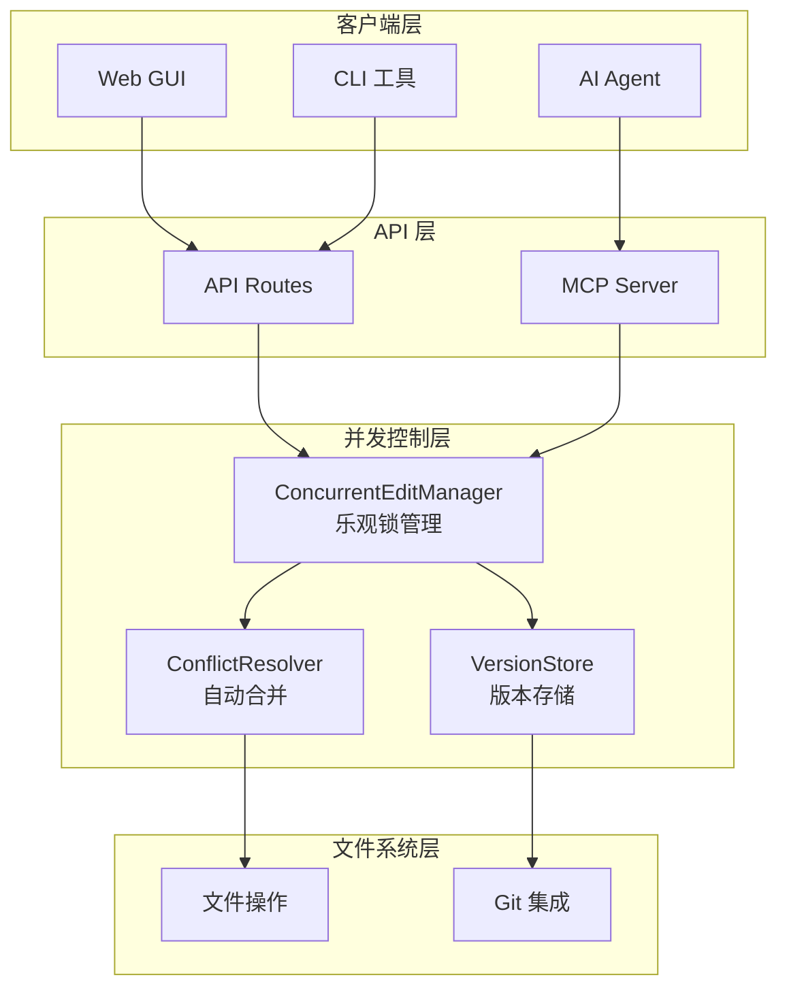

# AIP-004: 并发写入冲突解决实施计划

## 概述

**目标：** 实现多 Agent 并发写入的安全机制，确保数据一致性  
**优先级：** P1 (高业务价值，高技术难度)  
**预计周期：** 4周  
**负责人：** 架构团队

## 问题分析

### 当前风险
1. **数据丢失风险**：多 Agent 同时写入同一文件可能覆盖彼此修改
2. **冲突检测缺失**：缺乏自动检测和解决机制
3. **用户体验差**：冲突时用户需要手动解决，操作复杂

### 技术挑战
- 文件系统级别的并发控制
- 自动合并算法的准确性
- 实时冲突检测性能

## 技术方案设计

### 1. 文件版本管理系统

```typescript
// 文件版本元数据
interface FileVersion {
  path: string;
  version: number;           // 单调递增版本号
  lastModified: string;     // ISO 8601 时间戳
  hash: string;             // 文件内容 SHA-256
  author?: string;          // 最后修改者
  parentVersion?: number;   // 父版本（用于冲突解决）
}

// 版本存储结构
interface VersionStore {
  getVersion(path: string): Promise<FileVersion | null>;
  setVersion(path: string, version: FileVersion): Promise<void>;
  getHistory(path: string, limit?: number): Promise<FileVersion[]>;
}
```

### 2. 乐观并发控制机制

```typescript
class ConcurrentEditManager {
  private locks = new Map<string, FileVersion>();
  
  /**
   * 获取文件编辑锁
   * @param path 文件路径
   * @returns 当前文件版本，用于后续冲突检测
   */
  async acquireLock(path: string): Promise<FileVersion> {
    const currentVersion = await this.versionStore.getVersion(path);
    if (!currentVersion) {
      // 新文件，创建初始版本
      const newVersion: FileVersion = {
        path,
        version: 1,
        lastModified: new Date().toISOString(),
        hash: await this.calculateHash(''),
      };
      await this.versionStore.setVersion(path, newVersion);
      return newVersion;
    }
    
    // 检查是否已被锁定
    if (this.locks.has(path)) {
      throw new MindOSError(
        ErrorCodes.CONCURRENT_MODIFICATION,
        `File ${path} is currently being edited by another agent`
      );
    }
    
    this.locks.set(path, currentVersion);
    return currentVersion;
  }
  
  /**
   * 提交修改，检查冲突
   */
  async commitChanges(
    path: string,
    baseVersion: FileVersion,
    newContent: string
  ): Promise<void> {
    const currentVersion = await this.versionStore.getVersion(path);
    if (!currentVersion || currentVersion.version !== baseVersion.version) {
      throw new MindOSError(
        ErrorCodes.CONCURRENT_MODIFICATION,
        `File ${path} has been modified since you started editing`
      );
    }
    
    const newHash = await this.calculateHash(newContent);
    const newVersion: FileVersion = {
      path,
      version: currentVersion.version + 1,
      lastModified: new Date().toISOString(),
      hash: newHash,
      parentVersion: currentVersion.version,
    };
    
    await this.versionStore.setVersion(path, newVersion);
    this.locks.delete(path);
  }
}
```

### 3. 自动合并算法

```typescript
class ConflictResolver {
  /**
   * 三向合并算法
   * @param base 共同祖先版本
   * @param current 当前版本
   * @param incoming 传入修改
   * @returns 合并后的内容
   */
  async resolveConflict(
    base: string,
    current: string,
    incoming: string
  ): Promise<ConflictResolution> {
    const baseLines = base.split('\n');
    const currentLines = current.split('\n');
    const incomingLines = incoming.split('\n');
    
    const result: string[] = [];
    const conflicts: Conflict[] = [];
    
    // 实现基于行的差异分析
    const diff = this.calculateDiff(baseLines, currentLines, incomingLines);
    
    for (const segment of diff) {
      if (segment.type === 'unchanged') {
        result.push(...segment.lines);
      } else if (segment.type === 'modified') {
        // 检查是否冲突
        if (segment.currentChange && segment.incomingChange) {
          // 检测到冲突
          conflicts.push({
            startLine: result.length,
            baseContent: segment.baseLines?.join('\n') || '',
            currentContent: segment.currentChange.join('\n'),
            incomingContent: segment.incomingChange.join('\n'),
          });
          result.push(`<<<<<<< Current\n${segment.currentChange.join('\n')}`);
          result.push('=======');
          result.push(`${segment.incomingChange.join('\n')}\n>>>>>>> Incoming`);
        } else if (segment.currentChange) {
          result.push(...segment.currentChange);
        } else if (segment.incomingChange) {
          result.push(...segment.incomingChange);
        }
      }
    }
    
    return {
      content: result.join('\n'),
      conflicts,
      hasConflicts: conflicts.length > 0,
    };
  }
}
```

### 4. 冲突解决界面设计

```typescript
interface ConflictResolutionUI {
  /**
   * 显示冲突解决对话框
   */
  showConflictDialog(
    path: string,
    conflict: Conflict,
    onResolve: (resolution: ConflictResolution) => void
  ): void;
  
  /**
   * 批量冲突处理
   */
  showBulkConflictDialog(
    conflicts: Map<string, Conflict[]>,
    onResolveAll: (resolutions: Map<string, ConflictResolution[]>) => void
  ): void;
}
```

## 实施计划

### 阶段1: 基础框架 (第1周)

#### 任务清单
- [ ] 创建 `app/lib/core/concurrent-control.ts`
- [ ] 实现 `FileVersion` 接口和 `VersionStore`
- [ ] 开发 `ConcurrentEditManager` 基础功能
- [ ] 单元测试框架搭建

#### 交付物
- 文件版本管理基础功能
- 乐观锁机制实现
- 基础测试覆盖

### 阶段2: 合并算法 (第2周)

#### 任务清单
- [ ] 实现 `ConflictResolver` 类
- [ ] 开发三向合并算法
- [ ] 集成差异检测库
- [ ] 算法准确性测试

#### 交付物
- 自动合并算法实现
- 冲突检测机制
- 合并准确性验证

### 阶段3: UI集成 (第3周)

#### 任务清单
- [ ] 开发冲突解决界面组件
- [ ] 集成到文件编辑器
- [ ] 实现批量冲突处理
- [ ] 用户交互测试

#### 交付物
- 冲突解决用户界面
- 批量处理功能
- 用户体验优化

### 阶段4: 系统集成 (第4周)

#### 任务清单
- [ ] 集成到 MCP Server
- [ ] 集成到 API Routes
- [ ] 性能优化和压力测试
- [ ] 文档和部署指南

#### 交付物
- 完整系统集成
- 性能基准测试
- 部署文档

## 技术架构图



## 性能考虑

### 内存优化
- 版本元数据内存缓存
- 差异计算流式处理
- 大文件分段合并

### 存储优化
- 版本历史压缩存储
- 增量版本记录
- 定期清理旧版本

### 并发性能
- 无锁数据结构
- 异步操作队列
- 批量处理优化

## 测试策略

### 单元测试
```typescript
describe('ConcurrentEditManager', () => {
  it('should detect concurrent modifications', async () => {
    // 测试并发检测逻辑
  });
  
  it('should resolve simple conflicts automatically', async () => {
    // 测试自动合并
  });
});
```

### 集成测试
- 多 Agent 并发写入场景
- 复杂冲突解决测试
- 性能压力测试

### 用户验收测试
- 冲突解决界面易用性
- 批量处理效率
- 错误恢复能力

## 风险评估与缓解

### 技术风险
| 风险 | 影响 | 概率 | 缓解策略 |
|------|------|------|----------|
| 合并算法准确性 | 高 | 中 | 多轮测试，人工验证机制 |
| 性能瓶颈 | 中 | 低 | 渐进式优化，性能监控 |
| 数据一致性 | 高 | 低 | 事务机制，回滚策略 |

### 实施风险
| 风险 | 影响 | 概率 | 缓解策略 |
|------|------|------|----------|
| 开发延期 | 中 | 中 | 分阶段交付，敏捷开发 |
| 集成复杂度 | 高 | 中 | 模块化设计，接口先行 |

## 成功指标

### 技术指标
- [ ] 冲突检测准确率：100%
- [ ] 自动合并成功率：> 90%
- [ ] 并发写入性能：< 10ms 延迟
- [ ] 系统稳定性：99.9%

### 用户体验指标
- [ ] 冲突解决时间：< 30秒
- [ ] 用户满意度：> 4.5/5
- [ ] 误操作率：< 1%

## 后续演进

### 短期优化 (1-2个月后)
- 智能合并建议（基于 AI）
- 冲突预测和预防
- 实时协作支持

### 长期规划 (3-6个月后)
- 分布式版本控制
- 跨设备同步
- 团队协作增强

## 结论

AIP-004 是 MindOS 架构改进的关键环节，通过实现可靠的并发控制机制，将为多 Agent 协作提供坚实的技术基础。建议按计划分阶段实施，重点关注算法准确性和用户体验。

---

**计划制定时间：** 2026-03-20  
**下次评审时间：** 2026-03-27 (阶段1完成时)  
**技术负责人：** 架构团队