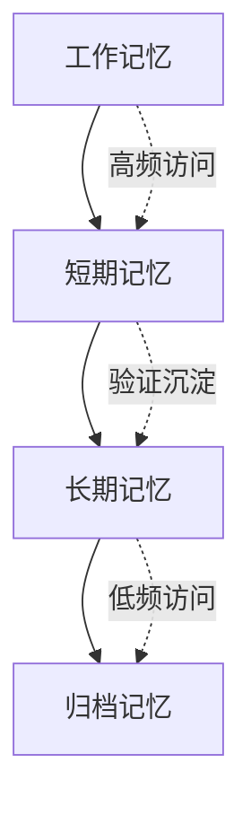

# MindOS 系统架构设计评审与建议

## 项目概述

MindOS 是一个 **Human-AI 协作心智系统**，核心目标是解决记忆割裂、记忆黑箱和经验断流三大痛点。通过本地优先的知识库和 MCP 协议，实现多 Agent 的统一记忆管理和经验沉淀。

**核心价值主张：** 一个共享的记忆层，让所有 Agent 可审计、可纠正、越用越智能。

## 当前架构分析

### 技术架构概览

```
┌─────────────────────────────────────────────────────────────────┐
│                         用户 & 外部 Agent                         │
└──────────┬──────────────────────┬───────────────────────────────┘
           │ Browser (GUI)        │ MCP Protocol (stdio/HTTP)
           ▼                      ▼
┌─────────────────────┐  ┌────────────────────────┐
│   app/ (Next.js 16) │  │  mcp/ (MCP Server)     │
│   ─────────────────  │  │  ────────────────────  │
│   • 前端 UI 组件     │  │  • 20+ MCP 工具        │
│   • API Routes       │  │  • stdio + HTTP 传输   │
│   • 内置 Agent       │  │  • Bearer Token 认证   │
│   • 插件渲染器       │  │  • 安全沙箱 & 写保护   │
└──────────┬──────────┘  └──────────┬─────────────┘
           │                        │
           ▼                        ▼
┌──────────────────────────────────────────────────┐
│              my-mind/ (本地纯文本知识库)             │
│  Markdown + CSV + JSON | Git 版本控制              │
└──────────────────────────────────────────────────┘
```

### 技术栈优势

1. **现代化前端技术栈**
   - Next.js 16 App Router：服务端组件 + 流式渲染
   - TypeScript：类型安全
   - Tailwind CSS + shadcn/ui：一致性设计系统
   - TipTap + CodeMirror 6：富文本 + 源码双模式编辑

2. **MCP 协议标准化**
   - 支持 stdio/HTTP 双传输模式
   - 20+ 工具覆盖完整知识库操作
   - Bearer Token 认证 + 路径沙箱安全机制

3. **本地优先架构**
   - 纯文本存储，Git 版本控制
   - 无外部依赖，数据主权完整
   - 原子写入防数据丢失

## 技术支柱分析

### Pillar 1: 异构群体智能调度与治理
**现状：** MCP Server 已支持多 Agent 并发连接
**挑战：** 缺乏细粒度权限控制和冲突解决机制

### Pillar 2: 经验编译与增量演化
**现状：** Skills 机制 + experience.md 半结构化经验回流
**挑战：** 缺乏自动从交互中提取 SOP 的能力

### Pillar 3: 动态记忆代谢与自组织心智网络
**现状：** Wiki Graph 提供链接拓扑，Agent Inspector 记录调用日志
**挑战：** 知识库只增不减，检索效率随使用下降

### Pillar 4: 个性化认知镜像与隐性意图对齐
**现状：** Profile 目录 + 交互轨迹记录
**挑战：** 缺乏从单用户长期文本轨迹中推断偏好的能力

## 架构优势评估

### ✅ 优势
1. **技术选型前瞻性**：Next.js 16 + MCP 协议处于技术前沿
2. **安全设计完善**：Bearer Token + 路径沙箱 + 写保护
3. **用户体验优秀**：Warm Amber 设计语言，键盘驱动交互
4. **扩展性良好**：插件化架构，支持多 Agent 接入

### ⚠️ 潜在风险
1. **技术复杂度高**：MCP 协议 + Next.js 16 学习曲线较陡
2. **性能瓶颈**：纯文本搜索在大规模知识库下可能性能不足
3. **数据一致性**：多 Agent 并发写入的冲突解决机制待完善

## 改进建议

### 短期优化（1-3个月）

#### 1. 性能优化
```typescript
// 建议实现增量索引机制
interface IncrementalIndex {
  lastIndexedAt: string;
  fileHashes: Map<string, string>;
  searchIndex: Map<string, string[]>;
}
```

#### 2. 冲突解决机制
```typescript
// 实现乐观并发控制
interface ConcurrentEdit {
  filePath: string;
  version: number;
  lastModified: string;
  conflictResolution: 'auto-merge' | 'manual' | 'reject';
}
```

#### 3. 监控与调试
- 添加 Agent 操作审计日志
- 实现性能指标监控面板
- 增强错误追踪和调试工具

### 中期规划（3-6个月）

#### 1. 智能记忆分层


#### 2. 经验自动编译
- 实现对话 → SOP 的自动转换管道
- 添加 SOP 质量评估机制
- 建立经验演化的版本控制

#### 3. 个性化推荐
- 基于交互历史的意图预测
- 上下文感知的知识推送
- 用户认知模型的演化追踪

### 长期愿景（6-12个月）

#### 1. 分布式协作
- 支持团队知识库共享
- 实现跨设备同步机制
- 建立知识贡献度评估

#### 2. AI 原生工作流
- 自动工作流生成与优化
- 多 Agent 协作任务编排
- 智能决策支持系统

#### 3. 生态系统建设
- 第三方插件市场
- API 开放平台
- 社区贡献机制

## 技术债务识别

### 代码质量
- **组件拆分不彻底**：部分大型组件需要进一步模块化
- **类型定义分散**：需要统一的类型定义文件
- **错误处理不统一**：错误处理机制需要标准化

### 测试覆盖
- **单元测试不足**：关键业务逻辑缺乏测试覆盖
- **集成测试缺失**：多 Agent 协作场景测试不足
- **性能测试空白**：大规模数据下的性能测试需要补充

### 文档完整性
- **API 文档不完整**：部分接口缺乏详细文档
- **部署指南缺失**：生产环境部署指南需要完善
- **故障排查手册**：常见问题排查指南需要补充

## 架构演进路线图

### Phase 1: 稳定性提升（当前）
- 完善错误处理和监控
- 优化性能瓶颈
- 增强测试覆盖

### Phase 2: 智能化增强（中期）
- 实现记忆分层和代谢
- 构建经验编译管道
- 开发个性化推荐

### Phase 3: 生态化建设（长期）
- 建立开放平台
- 支持团队协作
- 构建开发者生态

## 风险评估与缓解策略

| 风险类别 | 风险描述 | 影响程度 | 缓解策略 |
|---------|---------|---------|---------|
| 技术风险 | MCP 协议标准变化 | 高 | 抽象协议层，保持向后兼容 |
| 性能风险 | 大规模知识库检索慢 | 中 | 实现增量索引，支持外部搜索引擎 |
| 安全风险 | 多 Agent 权限控制 | 高 | 实现细粒度权限模型，审计所有操作 |
| 市场风险 | 竞品快速跟进 | 中 | 建立技术壁垒，专注差异化功能 |

## 结论与建议

MindOS 的架构设计具有前瞻性和创新性，技术选型合理，设计理念先进。建议：

1. **优先解决技术债务**：完善测试覆盖，统一错误处理
2. **聚焦核心差异化**：深度打磨四个技术支柱
3. **平衡功能与稳定性**：在创新功能开发的同时确保系统稳定
4. **建立技术壁垒**：通过专利和技术标准建立竞争优势

该项目在 Human-AI 协作领域具有重要创新价值，建议持续投入资源进行深度开发。