# MindOS 技术架构图 (Architecture Diagrams)

## 系统整体架构图

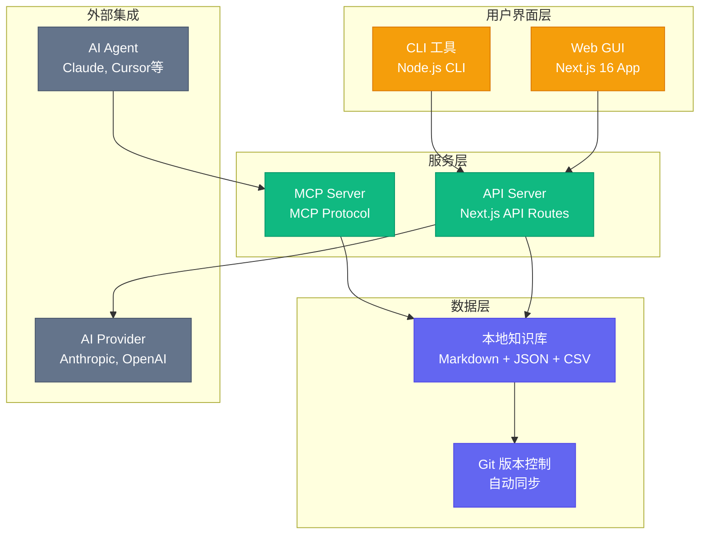

## 数据流程图

### AI 对话数据流

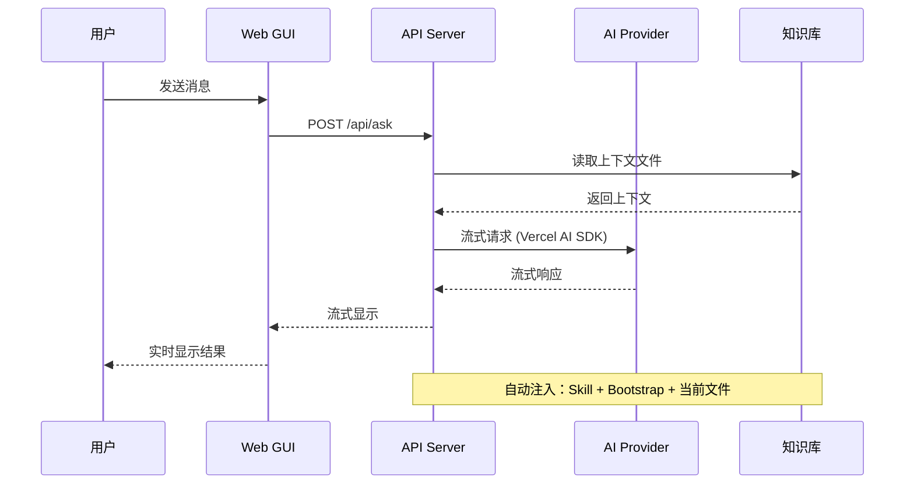

### MCP 协议数据流

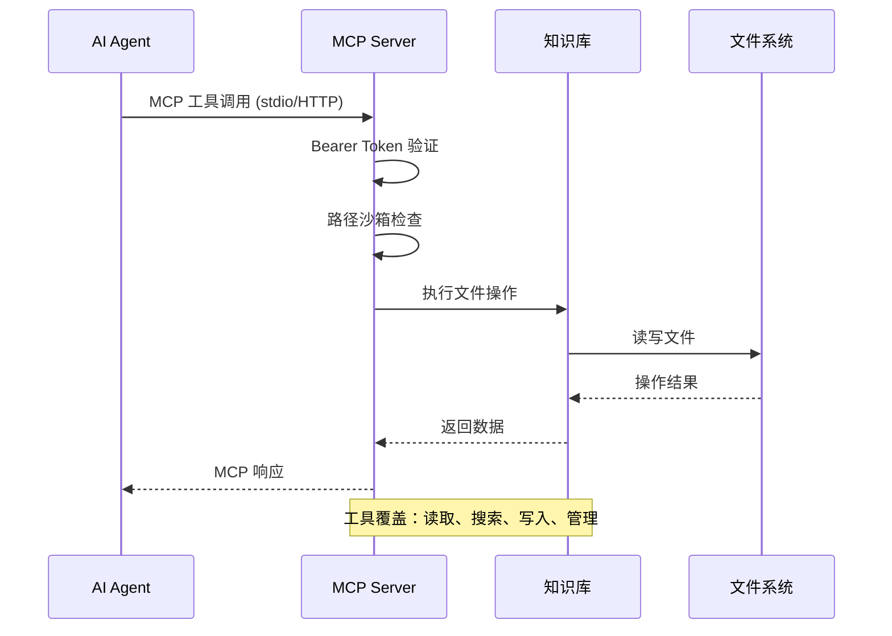

## 组件关系图

### 前端应用架构

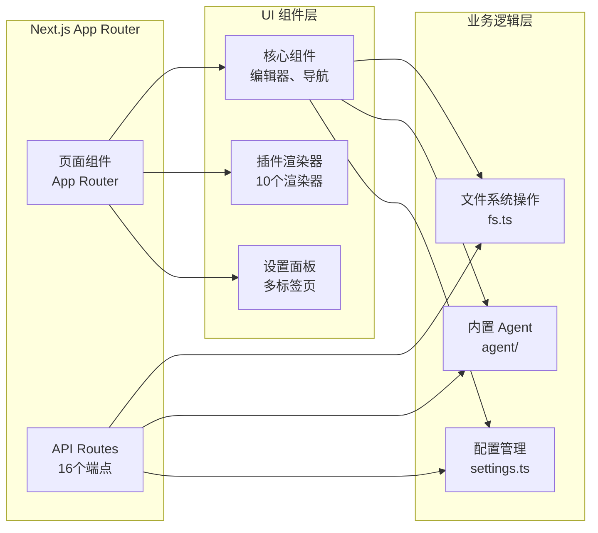

### MCP 服务器架构

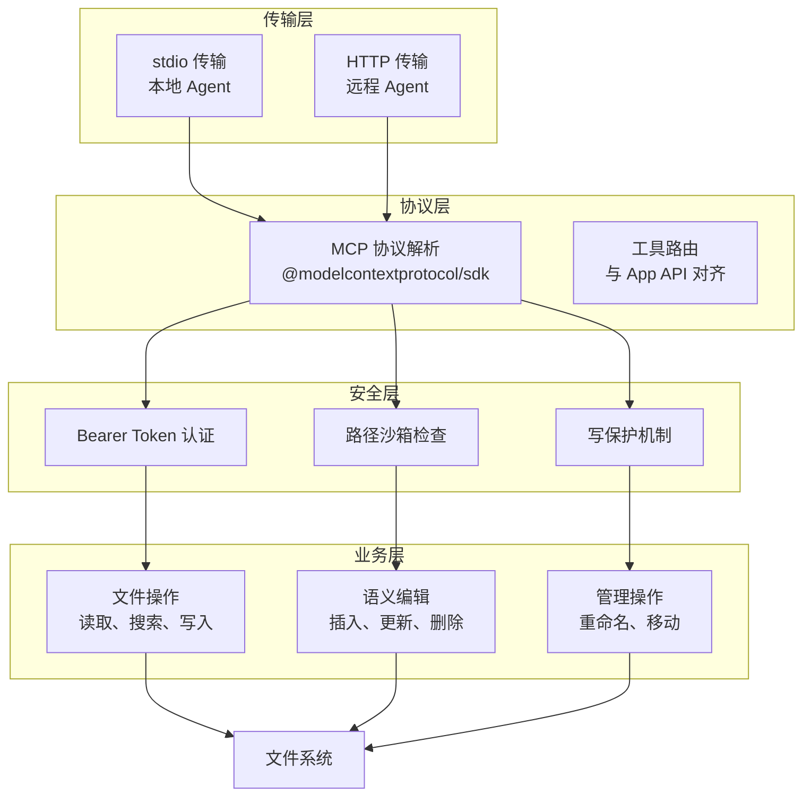

## 技术支柱架构图

### Pillar 1: 群体智能调度

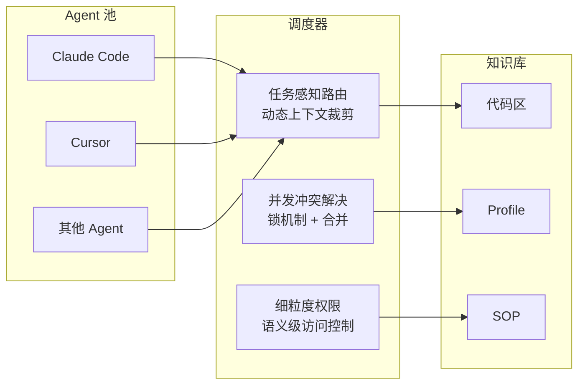

### Pillar 2: 经验编译管道

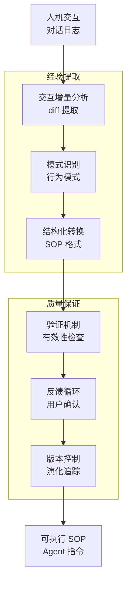

### Pillar 3: 记忆代谢系统

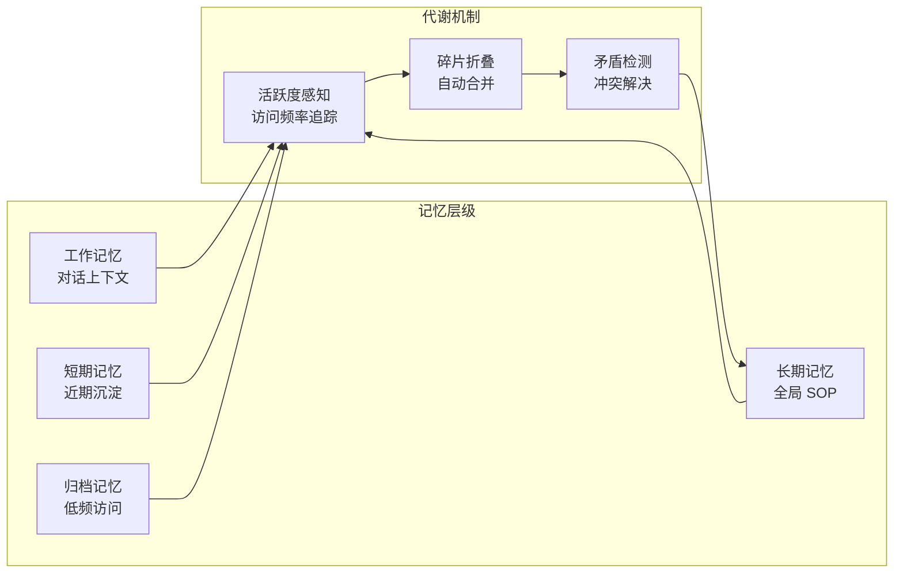

### Pillar 4: 认知镜像系统

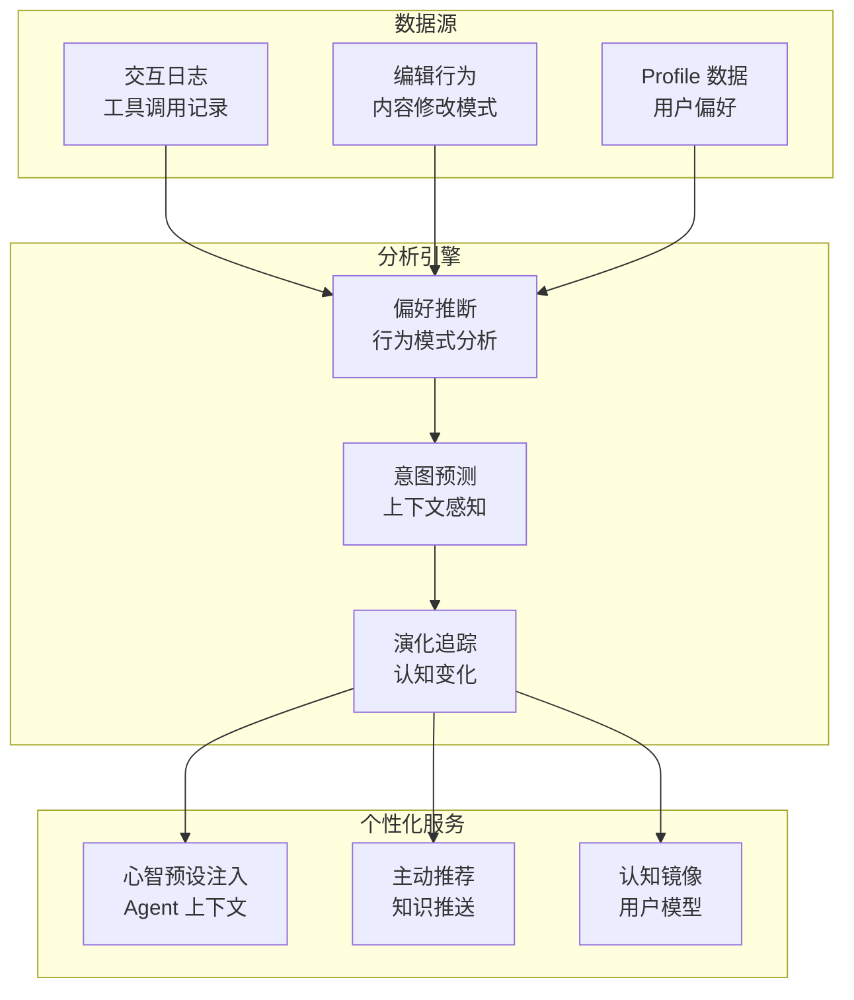

## 部署架构图

### 本地部署架构

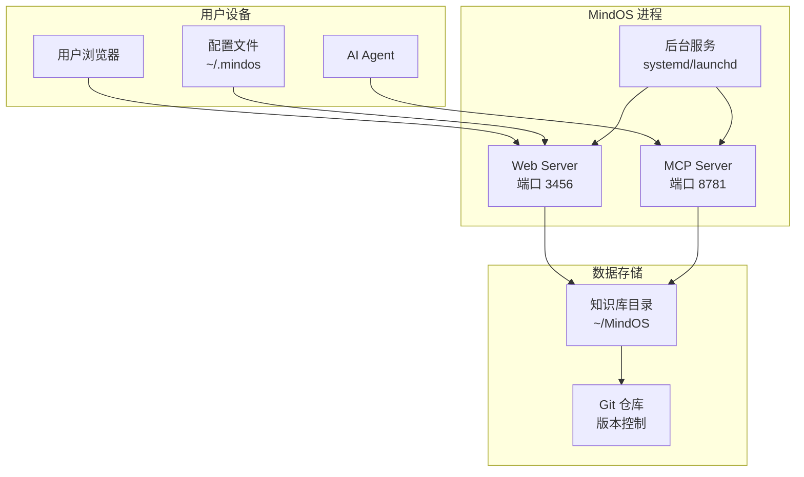

### 网络部署架构

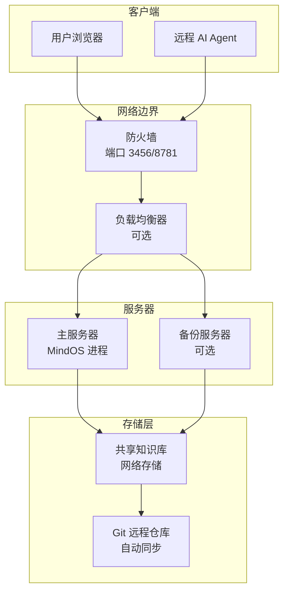

## 安全架构图

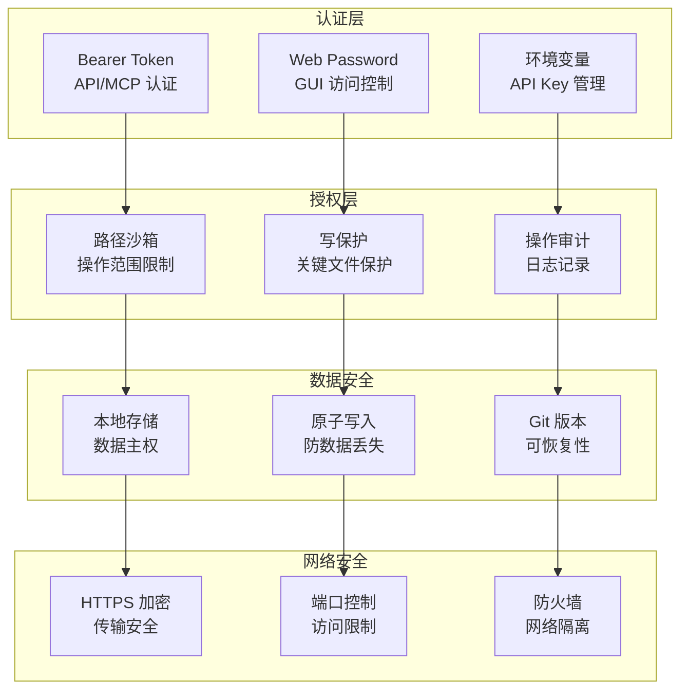

## 总结

这些架构图展示了 MindOS 系统的完整技术架构，包括：

1. **分层架构**：清晰的 UI/服务/数据分层
2. **数据流**：详细的请求处理流程
3. **组件关系**：模块间的依赖和交互
4. **技术支柱**：四个核心创新点的实现架构
5. **部署方案**：本地和网络部署模式
6. **安全机制**：多层次的安全保护体系

这些图表有助于理解系统的复杂性，指导后续的开发和优化工作。