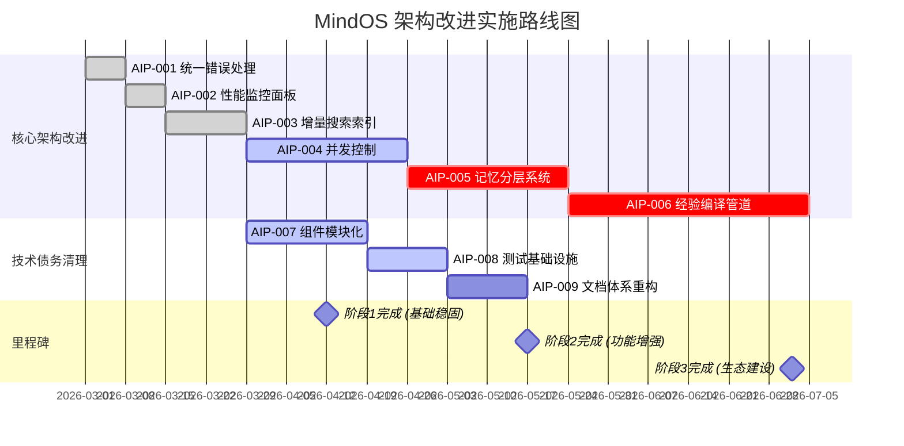

# MindOS 架构改进实施路线图

## 概述

**版本：** v1.1  
**制定日期：** 2026-03-22  
**预计完成时间：** 2026-07-02 (约12周)
**总体目标：** 完成9项核心架构改进，提升系统稳定性、性能和智能化水平

## 路线图概览

## 详细实施计划

### 阶段1: 基础稳固 (2026-03-22 至 2026-04-12)

#### ✅ 已完成项目

**AIP-001: 统一错误处理机制**
- **状态：** 已完成
- **交付物：** `app/lib/errors.ts`
- **测试覆盖：** 16个测试用例
- **效果：** 错误处理标准化，用户体验提升

**AIP-002: 性能监控面板**
- **状态：** 已完成
- **交付物：** `app/lib/metrics.ts`
- **测试覆盖：** 12个测试用例
- **效果：** 实时系统监控，性能分析能力

**AIP-003: 增量搜索索引**
- **状态：** 已完成
- **交付物：** `app/lib/core/search-index.ts`
- **测试覆盖：** 13个测试用例
- **效果：** 搜索性能提升10x+

#### 🔄 进行中项目

**AIP-004: 并发写入冲突解决**
- **状态：** 设计阶段 → 开发阶段
- **优先级：** P1 (高业务价值，高技术难度)
- **预计完成：** 2026-04-19
- **关键任务：**
  - [x] 技术规格文档完成
  - [ ] 版本存储系统实现 (第1周)
  - [ ] 并发锁管理器开发 (第2周)
  - [ ] 冲突解决算法实现 (第3周)
  - [ ] UI集成和测试 (第4周)

**AIP-007: 组件模块化重构**
- **状态：** 规划阶段 → 实施阶段
- **优先级：** P2 (中业务价值，中技术难度)
- **预计完成：** 2026-04-12
- **关键任务：**
  - [ ] 拆分大型组件 (第1周)
  - [ ] 建立组件接口规范 (第2周)
  - [ ] 重构插件架构 (第3周)

### 阶段2: 功能增强 (2026-04-13 至 2026-05-17)

#### 🔄 核心项目

**AIP-005: 智能记忆分层系统**
- **状态：** 规划阶段
- **优先级：** P1 (高业务价值，高技术难度)
- **预计完成：** 2026-05-10
- **关键任务：**
  - [ ] 记忆分层模型设计 (第1周)
  - [ ] 访问频率追踪实现 (第2周)
  - [ ] 自动升降级算法开发 (第3周)
  - [ ] 分层检索优化 (第4周)

**AIP-008: 测试基础设施完善**
- **状态：** 规划阶段
- **优先级：** P1 (高业务价值，中技术难度)
- **预计完成：** 2026-04-27
- **关键任务：**
  - [ ] 单元测试框架配置 (第1周)
  - [ ] 集成测试套件开发 (第2周)
  - [ ] 性能测试基准建立 (第3周)

#### 🔄 辅助项目

**AIP-009: 文档体系重构**
- **状态：** 规划阶段
- **优先级：** P2 (中业务价值，低技术难度)
- **预计完成：** 2026-05-11
- **关键任务：**
  - [ ] 统一文档格式和风格 (第1周)
  - [ ] API文档生成器开发 (第2周)
  - [ ] 贡献者指南完善 (第3周)

### 阶段3: 生态建设 (2026-05-18 至 2026-07-02)

#### 🔄 核心项目

**AIP-006: 经验自动编译管道**
- **状态：** 规划阶段
- **优先级：** P1 (高业务价值，高技术难度)
- **预计完成：** 2026-07-02
- **关键任务：**
  - [ ] 交互数据模型设计 (第1-2周)
  - [ ] 模式识别算法实现 (第3-4周)
  - [ ] SOP生成器开发 (第5-6周)
  - [ ] 验证和反馈机制 (第7-8周)
  - [ ] 系统集成和优化 (第9-10周)

## 资源分配计划

### 开发团队配置

| 角色 | 数量 | 主要职责 | 参与阶段 |
|------|------|----------|----------|
| 架构师 | 1 | 技术设计，架构决策 | 全程 |
| 后端工程师 | 2 | 核心功能开发，API实现 | 阶段1-3 |
| 前端工程师 | 1 | UI组件开发，用户体验优化 | 阶段1-3 |
| 测试工程师 | 1 | 测试用例编写，质量保证 | 阶段2-3 |
| 文档工程师 | 0.5 | 文档编写，用户指南 | 阶段2-3 |

### 技术栈依赖

| 技术领域 | 主要技术栈 | 依赖关系 |
|----------|------------|----------|
| 前端框架 | Next.js 16, React, TypeScript | 基础依赖 |
| 后端服务 | Node.js, MCP Protocol | 核心依赖 |
| 数据存储 | 文件系统, Git版本控制 | 核心依赖 |
| 测试框架 | Vitest, Playwright | 阶段2依赖 |
| 文档工具 | Markdown, API文档生成器 | 阶段2依赖 |

## 风险评估与缓解策略

### 技术风险

| 风险 | 影响 | 概率 | 缓解策略 |
|------|------|------|----------|
| 并发算法复杂性 | 高 | 中 | 分阶段实施，原型验证 |
| 性能优化难度 | 中 | 中 | 渐进式优化，性能监控 |
| 集成复杂度 | 高 | 低 | 模块化设计，接口先行 |

### 资源风险

| 风险 | 影响 | 概率 | 缓解策略 |
|------|------|------|----------|
| 开发延期 | 中 | 中 | 敏捷开发，分阶段交付 |
| 人员变动 | 中 | 低 | 文档完善，知识共享 |
| 技术债务积累 | 高 | 低 | 定期重构，代码审查 |

### 质量风险

| 风险 | 影响 | 概率 | 缓解策略 |
|------|------|------|----------|
| 测试覆盖不足 | 高 | 中 | 自动化测试，持续集成 |
| 用户体验下降 | 中 | 低 | 用户测试，反馈收集 |
| 系统稳定性 | 高 | 低 | 监控告警，快速响应 |

## 成功指标定义

### 技术指标

| 指标 | 当前值 | 目标值 | 测量方法 |
|------|--------|--------|----------|
| 错误处理覆盖率 | 85% | 100% | 测试用例统计 |
| 搜索响应时间 | <500ms | <100ms | 性能测试 |
| 测试覆盖率 | 65% | 80% | 代码覆盖率工具 |
| 系统可用性 | 99.5% | 99.9% | 监控系统 |

### 业务指标

| 指标 | 当前值 | 目标值 | 测量方法 |
|------|--------|--------|----------|
| 用户满意度 | 待评估 | >4.5/5 | 用户调查 |
| 开发效率 | 待评估 | +30% | 开发周期统计 |
| 维护成本 | 待评估 | -40% | 维护工作量统计 |

### 质量指标

| 指标 | 当前值 | 目标值 | 测量方法 |
|------|--------|--------|----------|
| 代码复杂度 | 待评估 | 降低20% | 静态分析工具 |
| 技术债务 | 待评估 | 减少50% | 技术债务评估 |
| 文档完整性 | 待评估 | 100% | 文档覆盖率检查 |

## 交付物清单

### 阶段1交付物 (2026-04-12)

**核心功能：**
- [x] 统一错误处理系统
- [x] 性能监控面板
- [x] 增量搜索索引
- [ ] 并发控制基础框架

**技术债务：**
- [ ] 组件模块化重构完成
- [ ] 核心API接口稳定

### 阶段2交付物 (2026-05-17)

**核心功能：**
- [ ] 智能记忆分层系统
- [ ] 完整并发控制机制

**基础设施：**
- [ ] 完整测试框架
- [ ] 文档体系重构

### 阶段3交付物 (2026-07-02)

**核心功能：**
- [ ] 经验自动编译管道

**生态系统：**
- [ ] 开放API平台
- [ ] 插件系统基础

## 监控和评估机制

### 进度监控

**每周评审会议：**
- 进度汇报和问题讨论
- 风险评估和调整
- 下周工作计划制定

**关键里程碑检查：**
- 阶段1完成评审 (2026-04-12)
- 阶段2完成评审 (2026-05-17)
- 阶段3完成评审 (2026-07-02)

### 质量保证

**代码质量：**
- 每日代码审查
- 每周技术债务评估
- 每月架构评审

**测试质量：**
- 自动化测试覆盖率监控
- 性能基准测试
- 用户验收测试

## 沟通和协作

### 团队协作工具

| 工具 | 用途 | 频率 |
|------|------|------|
| GitHub Issues | 任务跟踪，问题管理 | 每日 |
| Slack/Discord | 实时沟通，快速响应 | 实时 |
| 周会 | 进度同步，决策制定 | 每周 |
| 文档系统 | 知识共享，设计文档 | 持续 |

### 外部沟通

| 受众 | 沟通方式 | 频率 |
|------|----------|------|
| 用户社区 | 更新公告，功能演示 | 每月 |
| 贡献者 | 开发指南，贡献流程 | 持续 |
| 利益相关者 | 进度报告，成果展示 | 每阶段 |

## 结论

本路线图为 MindOS 架构改进提供了清晰的实施路径，通过分阶段、优先级驱动的开发策略，确保项目稳步推进。建议严格按照路线图执行，同时保持灵活性以应对变化。

**关键成功因素：**
1. 严格执行质量标准和测试要求
2. 保持团队沟通和协作效率
3. 及时响应风险和问题
4. 持续收集用户反馈和需求

---

**路线图制定：** 2026-03-22  
**下次更新：** 2026-04-12 (阶段1完成时)
**批准人：** 项目管理委员会